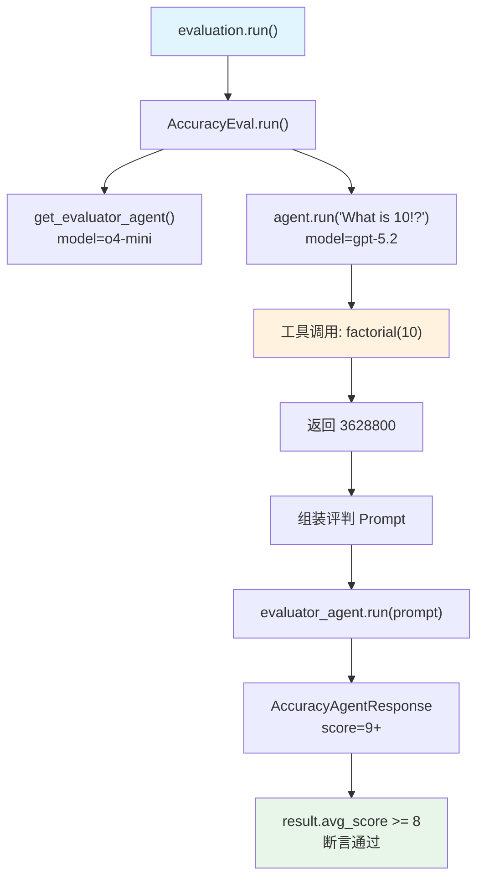

# accuracy_with_tools.py — 实现原理分析

> 源文件：`cookbook/09_evals/accuracy/accuracy_with_tools.py`

## 概述

本示例展示 Agno **`AccuracyEval`** 对工具调用 Agent 的评估：被评估 Agent 需要调用 `factorial` 工具计算 `10!`，评判模型验证输出是否等于 `3628800`。

**核心配置一览：**

| 配置项 | 值 | 说明 |
|--------|------|------|
| `name` | `"Tools Evaluation"` | 评估名称 |
| `model` | `OpenAIChat(id="o4-mini")` | 评判模型 |
| `agent` | `Agent(OpenAIChat("gpt-5.2"), tools=[CalculatorTools()])` | 被评估 Agent |
| `input` | `"What is 10!?"` | 评估输入 |
| `expected_output` | `"3628800"` | 期望输出 |
| `additional_guidelines` | `None` | 未设置 |
| `num_iterations` | `1`（默认） | 迭代次数 |
| `db` | `None` | 不持久化 |

## 架构分层

```
用户代码层                      agno.eval 层
┌────────────────────┐    ┌────────────────────────────────────────┐
│ accuracy_with_     │    │ AccuracyEval.run()                     │
│ tools.py           │    │  ├─ get_evaluator_agent() → judge      │
│                    │    │  ├─ agent.run("What is 10!?")          │
│ evaluation.run()  │───>│  │    → 调用 factorial 工具            │
│                    │    │  ├─ evaluate_answer()                  │
│                    │    │  └─ result.avg_score >= 8              │
└────────────────────┘    └────────────────────────────────────────┘
                                    │
                    ┌───────────────┴────────────────┐
                    ▼                                ▼
            ┌──────────────┐              ┌──────────────────┐
            │ OpenAIChat   │              │ OpenAIChat       │
            │ gpt-5.2      │              │ o4-mini          │
            │ + factorial  │              │ (judge)          │
            └──────────────┘              └──────────────────┘
```

## 核心组件解析

### 工具调用流程

被评估 Agent 使用 `CalculatorTools`，关键工具为 `factorial(n)`：

```python
agent = Agent(
    model=OpenAIChat(id="gpt-5.2"),
    tools=[CalculatorTools()],  # 包含 factorial, multiply, exponentiate 等
)
# 调用时模型会触发 tool_call: factorial(10)
response = agent.run("What is 10!?")
```

### 评判逻辑（无 additional_guidelines）

未设置 `additional_guidelines` 时，评判 Agent 只按默认标准（Accuracy + Completeness）评分：

```python
# accuracy.py:205 - additional_guidelines 为空时不追加
additional_guidelines = ""  # 空字符串，不影响 system prompt
```

## System Prompt 组装（评判 Agent）

| 组成部分 | 内容 |
|---------|------|
| `description` | "You are an expert judge..." |
| 评估标准 | Accuracy + Completeness（对比 expected_output） |
| 评分规则 | 1-10 分，无额外指引 |
| `output_schema` | `AccuracyAgentResponse` |

## 完整 API 请求

**第 1 步：工具调用（Agent 计算 10!）**

```python
client.chat.completions.create(
    model="gpt-5.2",
    messages=[{"role": "user", "content": "What is 10!?"}],
    tools=[{"type": "function", "function": {"name": "factorial", "parameters": {...}}}],
    stream=False
)
# → tool_call: factorial(n=10) → "3628800"
# → 第二轮: messages + tool_result → 最终文本输出
```

**第 2 步：评判 Agent 打分**

```python
client.chat.completions.create(
    model="o4-mini",
    messages=[
        {"role": "system", "content": "You are an expert judge..."},
        {"role": "user", "content": "<agent_input>What is 10!?</agent_input>\n<expected_output>3628800</expected_output>\n<agent_output>[实际输出]</agent_output>"}
    ],
    response_format={"type": "json_schema", ...},
    stream=False
)
```

## Mermaid 流程图



## 关键源码文件索引

| 文件 | 关键函数/类 | 作用 |
|------|------------|------|
| `agno/eval/accuracy.py` | `AccuracyEval.run()` L343 | 同步评估主流程 |
| `agno/eval/accuracy.py` | `get_evaluator_agent()` L188 | 构建 judge Agent |
| `agno/eval/accuracy.py` | `evaluate_answer()` L277 | 单次评判 |
| `agno/tools/calculator.py` | `factorial()` | 被调用的计算器工具 |
