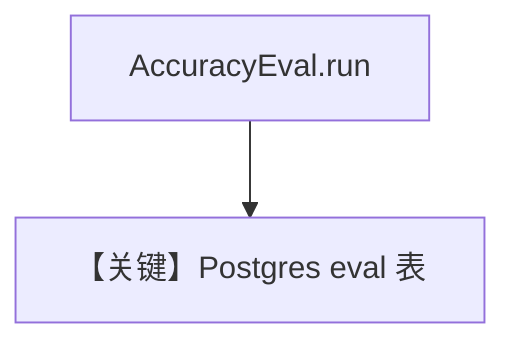

# db_logging.py — 实现原理分析

> 源文件：`cookbook/09_evals/accuracy/db_logging.py`

## 概述

本示例在 **`AccuracyEval` 上挂 `PostgresDb(eval_table="eval_runs_cookbook")`**，将评测运行结果写入 PostgreSQL（端口 **5432**，与部分 cookbook 5532 不同，注意环境）。

**核心配置一览：**

| 配置项 | 值 | 说明 |
|--------|------|------|
| `db_url` | `postgresql+psycopg://ai:ai@localhost:5432/ai` | 5432 |
| `AccuracyEval.db` | `db` | 持久化 eval 运行记录 |

## 核心组件解析

副作用：每次 `run` 可向 `eval_runs_cookbook` 写入行，便于仪表盘与回归对比。

## System Prompt 组装

同 `accuracy_basic`（被测 Agent + 评判器）。

## 完整 API 请求

与无 DB 的 AccuracyEval 相同，额外 DB 写入。

## Mermaid 流程图

## 关键源码文件索引

| 文件 | 作用 |
|------|------|
| `agno/eval/accuracy.py` | DB 挂钩 |
| `agno/db/postgres` | `eval_table` |
