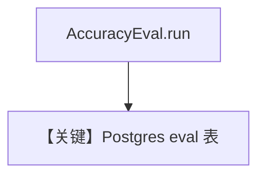

# db_logging.py — 实现原理分析

<!-- cookbook-py-source:start -->
## 完整源码

```python
"""
Accuracy Evaluation with Database Logging
=========================================

Demonstrates storing accuracy evaluation results in PostgreSQL.
"""

from typing import Optional

from agno.agent import Agent
from agno.db.postgres.postgres import PostgresDb
from agno.eval.accuracy import AccuracyEval, AccuracyResult
from agno.models.openai import OpenAIChat
from agno.tools.calculator import CalculatorTools

# ---------------------------------------------------------------------------
# Create Database
# ---------------------------------------------------------------------------
db_url = "postgresql+psycopg://ai:ai@localhost:5432/ai"
db = PostgresDb(db_url=db_url, eval_table="eval_runs_cookbook")

# ---------------------------------------------------------------------------
# Create Evaluation
# ---------------------------------------------------------------------------
evaluation = AccuracyEval(
    db=db,
    name="Calculator Evaluation",
    model=OpenAIChat(id="o4-mini"),
    agent=Agent(
        model=OpenAIChat(id="gpt-4o"),
        tools=[CalculatorTools()],
    ),
    input="What is 10*5 then to the power of 2? do it step by step",
    expected_output="2500",
    additional_guidelines="Agent output should include the steps and the final answer.",
    num_iterations=1,
)

# ---------------------------------------------------------------------------
# Run Evaluation
# ---------------------------------------------------------------------------
if __name__ == "__main__":
    result: Optional[AccuracyResult] = evaluation.run(print_results=True)
    assert result is not None and result.avg_score >= 8
```

<!-- cookbook-py-source:end -->

> 源文件：`cookbook/09_evals/accuracy/db_logging.py`

## 概述

本示例在 **`AccuracyEval` 上挂 `PostgresDb(eval_table="eval_runs_cookbook")`**，将评测运行结果写入 PostgreSQL（端口 **5432**，与部分 cookbook 5532 不同，注意环境）。

**核心配置一览：**

| 配置项 | 值 | 说明 |
|--------|------|------|
| `db_url` | `postgresql+psycopg://ai:ai@localhost:5432/ai` | 5432 |
| `AccuracyEval.db` | `db` | 持久化 eval 运行记录 |

## 核心组件解析

副作用：每次 `run` 可向 `eval_runs_cookbook` 写入行，便于仪表盘与回归对比。

## System Prompt 组装

同 `accuracy_basic`（被测 Agent + 评判器）。

## 完整 API 请求

与无 DB 的 AccuracyEval 相同，额外 DB 写入。

## Mermaid 流程图



## 关键源码文件索引

| 文件 | 作用 |
|------|------|
| `agno/eval/accuracy.py` | DB 挂钩 |
| `agno/db/postgres` | `eval_table` |
