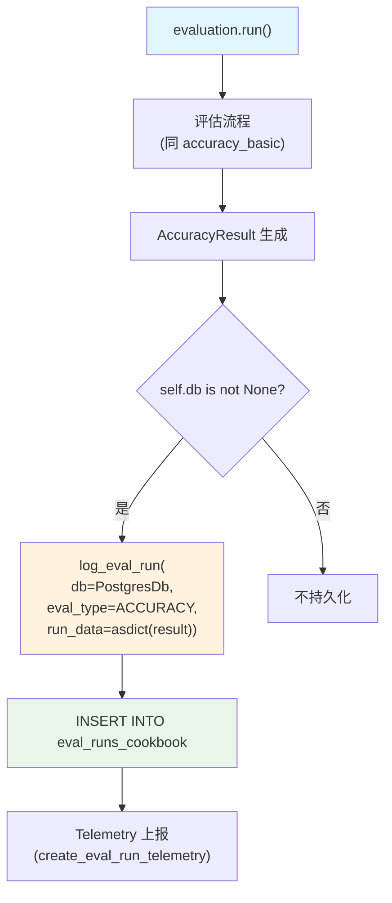

# db_logging.py (accuracy) — 实现原理分析

> 源文件：`cookbook/09_evals/accuracy/db_logging.py`

## 概述

本示例展示 **`AccuracyEval`** 的 **PostgreSQL 数据库日志记录**机制：将每次评估运行结果持久化到 `eval_runs_cookbook` 表，便于历史追踪和分析。

**核心配置一览：**

| 配置项 | 值 | 说明 |
|--------|------|------|
| `db` | `PostgresDb(db_url=..., eval_table="eval_runs_cookbook")` | PostgreSQL 日志数据库 |
| `name` | `"Calculator Evaluation"` | 评估名称 |
| `model` | `OpenAIChat(id="o4-mini")` | 评判模型 |
| `agent` | `Agent(OpenAIChat("gpt-4o"), tools=[CalculatorTools()])` | 被评估 Agent |
| `input` | 多步计算问题 | 评估输入 |
| `expected_output` | `"2500"` | 期望输出 |
| `num_iterations` | `1` | 迭代次数 |

## 架构分层

```
用户代码层                      agno.eval 层
┌──────────────────────┐    ┌────────────────────────────────────────┐
│ db_logging.py        │    │ AccuracyEval.run()                     │
│                      │    │  ├─ 评估流程（与 accuracy_basic 相同）  │
│ db = PostgresDb(     │───>│  ├─ 评估完成后                         │
│   eval_table=        │    │  └─ if self.db:                        │
│   "eval_runs_        │    │       log_eval_run(db=db, ...)         │
│   cookbook")         │    │       → INSERT INTO eval_runs_cookbook  │
└──────────────────────┘    └────────────────────────────────────────┘
                                              │
                                              ▼
                                    ┌──────────────────┐
                                    │ PostgreSQL        │
                                    │ eval_runs_cookbook│
                                    └──────────────────┘
```

## 核心组件解析

### DB 日志写入流程

评估完成后，`run()` 调用 `log_eval_run()`（`accuracy.py:456-477`）：

```python
if self.db:
    log_eval_input = {
        "additional_guidelines": self.additional_guidelines,
        "additional_context": self.additional_context,
        "num_iterations": self.num_iterations,
        "expected_output": self.expected_output,
        "input": self.input,
    }

    log_eval_run(
        db=self.db,
        run_id=self.eval_id,
        run_data=asdict(self.result),  # 包含所有 AccuracyEvaluation 结果
        eval_type=EvalType.ACCURACY,
        agent_id=agent_id,
        model_id=model_id,
        model_provider=model_provider,
        name=self.name,
        evaluated_component_name=self.agent.name,
        eval_input=log_eval_input,
    )
```

### PostgresDb eval_table 参数

`PostgresDb(eval_table="eval_runs_cookbook")` 指定评估结果写入的表名，与 Agent session 使用的普通表分离：

```python
db = PostgresDb(
    db_url="postgresql+psycopg://ai:ai@localhost:5432/ai",
    eval_table="eval_runs_cookbook",  # 专用评估结果表
)
```

### AsyncBaseDb 限制

同步 `run()` 不支持 `AsyncBaseDb`（`accuracy.py:349-350`）：

```python
if isinstance(self.db, AsyncBaseDb):
    raise ValueError("run() is not supported with an async DB. Please use arun() instead.")
```

## Mermaid 流程图



## 关键源码文件索引

| 文件 | 关键函数/类 | 作用 |
|------|------------|------|
| `agno/eval/accuracy.py` | `run()` L456-477 | DB 日志写入逻辑 |
| `agno/eval/utils.py` | `log_eval_run()` | 通用评估结果写入函数 |
| `agno/db/postgres/postgres.py` | `PostgresDb` | PostgreSQL 数据库适配器 |
| `agno/db/schemas/evals.py` | `EvalType.ACCURACY` | 评估类型枚举 |
