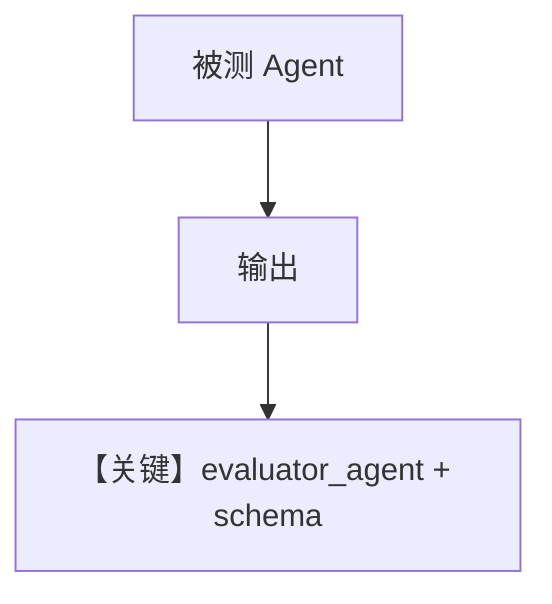

# evaluator_agent.py — 实现原理分析

<!-- cookbook-py-source:start -->
## 完整源码

```python
"""
Accuracy Evaluation with Custom Evaluator Agent
================================================

Demonstrates accuracy evaluation using a custom evaluator agent.
"""

from typing import Optional

from agno.agent import Agent
from agno.eval.accuracy import AccuracyAgentResponse, AccuracyEval, AccuracyResult
from agno.models.openai import OpenAIChat
from agno.tools.calculator import CalculatorTools

# ---------------------------------------------------------------------------
# Create Evaluator Agent
# ---------------------------------------------------------------------------
evaluator_agent = Agent(
    model=OpenAIChat(id="gpt-5"),
    output_schema=AccuracyAgentResponse,
)

# ---------------------------------------------------------------------------
# Create Evaluation
# ---------------------------------------------------------------------------
evaluation = AccuracyEval(
    model=OpenAIChat(id="o4-mini"),
    agent=Agent(model=OpenAIChat(id="gpt-5.2"), tools=[CalculatorTools()]),
    input="What is 10*5 then to the power of 2? do it step by step",
    expected_output="2500",
    evaluator_agent=evaluator_agent,
    additional_guidelines="Agent output should include the steps and the final answer.",
)

# ---------------------------------------------------------------------------
# Run Evaluation
# ---------------------------------------------------------------------------
if __name__ == "__main__":
    result: Optional[AccuracyResult] = evaluation.run(print_results=True)
    assert result is not None and result.avg_score >= 8
```

<!-- cookbook-py-source:end -->

> 源文件：`cookbook/09_evals/accuracy/evaluator_agent.py`

## 概述

本示例传入 **自定义 `evaluator_agent`**：`output_schema=AccuracyAgentResponse`，用结构化输出约束评分理由与分数解析。

**核心配置一览：**

| 配置项 | 值 | 说明 |
|--------|------|------|
| `evaluator_agent` | `OpenAIChat(id="gpt-5")` + `AccuracyAgentResponse` | 自定义评判 |
| `AccuracyEval.model` | `o4-mini` | 若未覆盖默认 evaluator，需以实际 `AccuracyEval` 构造为准；本文件显式提供 `evaluator_agent` |

## 核心组件解析

`AccuracyEval` 优先使用用户提供的 evaluator，便于统一 schema 与解析路径。

## System Prompt 组装

被测：`gpt-5.2` + Calculator；评判：带 `output_schema` 的 parser 路径（`# 3.3.15`/`# 3.3.16` 等可能参与）。

## 完整 API 请求

评判侧可能启用结构化输出 API 能力（视 `gpt-5` 与模型能力标志）。

## Mermaid 流程图



## 关键源码文件索引

| 文件 | 作用 |
|------|------|
| `agno/eval/accuracy.py` | `AccuracyAgentResponse` |
| `agno/eval/accuracy.py` | `evaluator_agent` 参数 |
