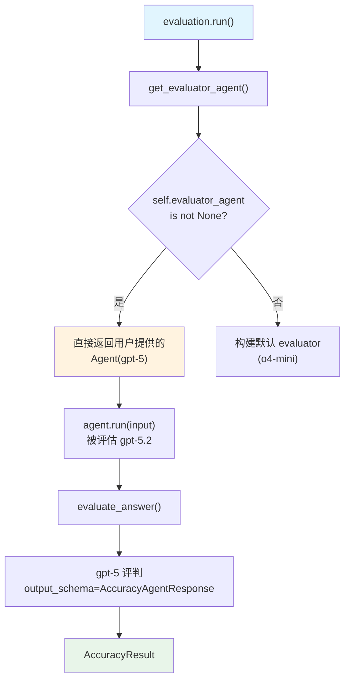

# evaluator_agent.py — 实现原理分析

> 源文件：`cookbook/09_evals/accuracy/evaluator_agent.py`

## 概述

本示例展示 **`AccuracyEval`** 的**自定义评判 Agent** 机制：用户提供自己的 `evaluator_agent`（使用 `output_schema=AccuracyAgentResponse`），替代默认的 o4-mini 评判模型。

**核心配置一览：**

| 配置项 | 值 | 说明 |
|--------|------|------|
| `evaluator_agent` | `Agent(OpenAIChat("gpt-5"), output_schema=AccuracyAgentResponse)` | 自定义评判 Agent |
| `model` | `OpenAIChat(id="o4-mini")` | 默认评判模型（被 evaluator_agent 覆盖） |
| `agent` | `Agent(OpenAIChat("gpt-5.2"), tools=[CalculatorTools()])` | 被评估 Agent |
| `input` | 多步计算问题 | 评估输入 |
| `expected_output` | `"2500"` | 期望输出 |
| `additional_guidelines` | `"Agent output should include the steps and the final answer."` | 评判指引 |

## 架构分层

```
用户代码层                         agno.eval 层
┌───────────────────────┐    ┌────────────────────────────────────────────┐
│ evaluator_agent.py    │    │ AccuracyEval.run()                         │
│                       │    │  ├─ get_evaluator_agent()                  │
│ evaluator_agent =     │───>│  │    → self.evaluator_agent is not None   │
│   Agent(gpt-5,        │    │  │    → 直接返回用户提供的 evaluator_agent  │
│   output_schema=...)  │    │  ├─ agent.run(input) → gpt-5.2 计算       │
│                       │    │  └─ evaluate_answer() → gpt-5 评判        │
└───────────────────────┘    └────────────────────────────────────────────┘
```

## 核心组件解析

### 自定义 evaluator_agent 覆盖默认

`get_evaluator_agent()` 中自定义优先（`accuracy.py:191-193`）：

```python
def get_evaluator_agent(self) -> Agent:
    if self.evaluator_agent is not None:
        return self.evaluator_agent  # ← 直接返回用户提供的
    # 否则才用 self.model 构建默认 evaluator
```

### 关键约束：output_schema 必须为 AccuracyAgentResponse

自定义 evaluator_agent 必须设置 `output_schema=AccuracyAgentResponse`，否则 `evaluate_answer()` 会报类型错误（`accuracy.py:297-298`）：

```python
accuracy_agent_response = response.content
if not isinstance(accuracy_agent_response, AccuracyAgentResponse):
    raise EvalError(f"Evaluator Agent returned an invalid response: {accuracy_agent_response}")
```

### 对比：自定义 vs 默认评判 Agent

| 方式 | 模型 | System Prompt | 输出格式 |
|------|------|--------------|---------|
| 默认（不设 evaluator_agent） | o4-mini | 硬编码评判指引 + guidelines | AccuracyAgentResponse |
| 自定义（设 evaluator_agent） | 任意 | 用户控制 | 必须设 `output_schema=AccuracyAgentResponse` |

## System Prompt 组装

自定义 evaluator_agent 使用其自身的配置，未设置 `description` 或 `instructions`，仅有 `output_schema`。实际 system prompt 取决于 `AccuracyAgentResponse` 的 schema 描述。

## 完整 API 请求

**评判 Agent（自定义 gpt-5）**

```python
client.chat.completions.create(
    model="gpt-5",
    messages=[
        {"role": "system", "content": ""},  # 无自定义 system_message
        {"role": "user", "content": "<agent_input>...<expected_output>2500</expected_output>..."}
    ],
    response_format={"type": "json_schema", "json_schema": {"name": "AccuracyAgentResponse", ...}},
    stream=False
)
```

## Mermaid 流程图



## 关键源码文件索引

| 文件 | 关键函数/类 | 作用 |
|------|------------|------|
| `agno/eval/accuracy.py` | `get_evaluator_agent()` L191-193 | 自定义 evaluator 优先逻辑 |
| `agno/eval/accuracy.py` | `evaluate_answer()` L297-298 | 强制 AccuracyAgentResponse 类型校验 |
| `agno/eval/accuracy.py` | `AccuracyAgentResponse` L24 | 评判输出 Pydantic schema |
