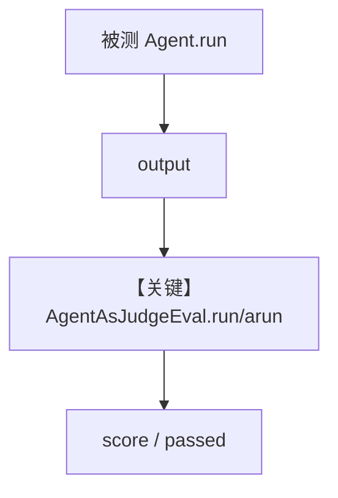

# agent_as_judge_basic.py — 实现原理分析

<!-- cookbook-py-source:start -->
## 完整源码

```python
"""
Basic Agent-as-Judge Evaluation
===============================

Demonstrates synchronous and asynchronous agent-as-judge evaluations.
"""

import asyncio

from agno.agent import Agent
from agno.db.postgres.postgres import PostgresDb
from agno.db.sqlite import AsyncSqliteDb
from agno.eval.agent_as_judge import AgentAsJudgeEval, AgentAsJudgeEvaluation
from agno.models.openai import OpenAIChat


def on_evaluation_failure(evaluation: AgentAsJudgeEvaluation):
    """Callback triggered when an evaluation score is below threshold."""
    print(f"Evaluation failed - Score: {evaluation.score}/10")
    print(f"Reason: {evaluation.reason[:100]}...")


# ---------------------------------------------------------------------------
# Create Sync Resources
# ---------------------------------------------------------------------------
sync_db_url = "postgresql+psycopg://ai:ai@localhost:5532/ai"
sync_db = PostgresDb(db_url=sync_db_url)

sync_agent = Agent(
    model=OpenAIChat(id="gpt-4o"),
    instructions="You are a technical writer. Explain concepts clearly and concisely.",
    db=sync_db,
)

sync_evaluation = AgentAsJudgeEval(
    name="Explanation Quality",
    criteria="Explanation should be clear, beginner-friendly, and use simple language",
    scoring_strategy="numeric",
    threshold=7,
    on_fail=on_evaluation_failure,
    db=sync_db,
)

# ---------------------------------------------------------------------------
# Create Async Resources
# ---------------------------------------------------------------------------
async_db = AsyncSqliteDb(db_file="tmp/agent_as_judge_async.db")

async_agent = Agent(
    model=OpenAIChat(id="gpt-4o"),
    instructions="Provide helpful and informative answers.",
    db=async_db,
)

async_evaluation = AgentAsJudgeEval(
    name="ML Explanation Quality",
    model=OpenAIChat(id="gpt-5.2"),
    criteria="Explanation should be clear, beginner-friendly, and avoid jargon",
    scoring_strategy="numeric",
    threshold=10,
    on_fail=on_evaluation_failure,
    db=async_db,
)


async def run_async_evaluation():
    async_response = await async_agent.arun("Explain machine learning in simple terms")
    async_result = await async_evaluation.arun(
        input="Explain machine learning in simple terms",
        output=str(async_response.content),
        print_results=True,
        print_summary=True,
    )
    assert async_result is not None, "Evaluation should return a result"

    print("Async Database Results:")
    async_eval_runs = await async_db.get_eval_runs()
    print(f"Total evaluations stored: {len(async_eval_runs)}")
    if async_eval_runs:
        latest = async_eval_runs[-1]
        print(f"Eval ID: {latest.run_id}")
        print(f"Name: {latest.name}")


# ---------------------------------------------------------------------------
# Run Evaluation
# ---------------------------------------------------------------------------
if __name__ == "__main__":
    sync_response = sync_agent.run("Explain what an API is")
    sync_evaluation.run(
        input="Explain what an API is",
        output=str(sync_response.content),
        print_results=True,
        print_summary=True,
    )

    print("Database Results:")
    sync_eval_runs = sync_db.get_eval_runs()
    print(f"Total evaluations stored: {len(sync_eval_runs)}")
    if sync_eval_runs:
        latest = sync_eval_runs[-1]
        print(f"Eval ID: {latest.run_id}")
        print(f"Name: {latest.name}")

    asyncio.run(run_async_evaluation())
```

<!-- cookbook-py-source:end -->

> 源文件：`cookbook/09_evals/agent_as_judge/agent_as_judge_basic.py`

## 概述

本示例演示 **`AgentAsJudgeEval`** 的同步与异步用法：用独立评判模型按 `criteria`、`scoring_strategy`、`threshold` 给被测输出打分；`on_fail` 回调；`db` 可选（Postgres + AsyncSqlite）。

**核心配置一览：**

| 配置项 | 值 | 说明 |
|--------|------|------|
| `sync_agent.instructions` | `"You are a technical writer..."` | 被测 |
| `sync_evaluation` | `criteria` + `numeric` + `threshold=7` + `on_fail` | 评判配置 |
| `async_evaluation` | 显式 `model=gpt-5.2`，`threshold=10` | 异步评判模型可覆盖默认 |

### 还原 sync_agent instructions

```text
You are a technical writer. Explain concepts clearly and concisely.
```

### 还原 async_agent instructions

```text
Provide helpful and informative answers.
```

## 核心组件解析

`AgentAsJudgeEval` 将 `input`/`output` 交给评判 Agent（默认或自定义），产出 `AgentAsJudgeEvaluation`。详见 `agno/eval/agent_as_judge.py`。

## System Prompt 组装

被测与评判各有一套 `get_system_message`；评判侧会拼接 `criteria`、评分策略等（以源码为准）。

## 完整 API 请求

`OpenAIChat` → Chat Completions。

## Mermaid 流程图



## 关键源码文件索引

| 文件 | 作用 |
|------|------|
| `agno/eval/agent_as_judge.py` | `AgentAsJudgeEval` |
