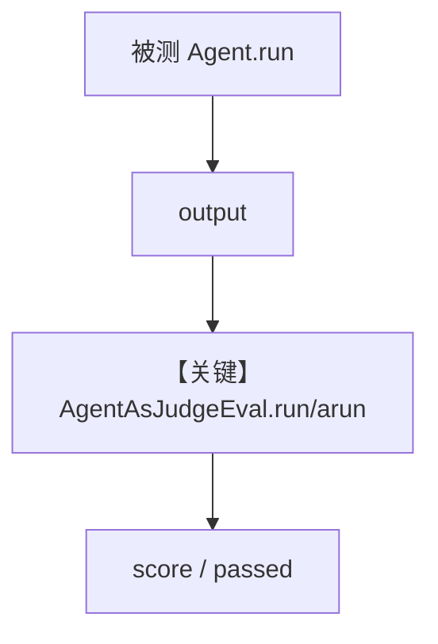

# agent_as_judge_basic.py — 实现原理分析

> 源文件：`cookbook/09_evals/agent_as_judge/agent_as_judge_basic.py`

## 概述

本示例演示 **`AgentAsJudgeEval`** 的同步与异步用法：用独立评判模型按 `criteria`、`scoring_strategy`、`threshold` 给被测输出打分；`on_fail` 回调；`db` 可选（Postgres + AsyncSqlite）。

**核心配置一览：**

| 配置项 | 值 | 说明 |
|--------|------|------|
| `sync_agent.instructions` | `"You are a technical writer..."` | 被测 |
| `sync_evaluation` | `criteria` + `numeric` + `threshold=7` + `on_fail` | 评判配置 |
| `async_evaluation` | 显式 `model=gpt-5.2`，`threshold=10` | 异步评判模型可覆盖默认 |

### 还原 sync_agent instructions

```text
You are a technical writer. Explain concepts clearly and concisely.
```

### 还原 async_agent instructions

```text
Provide helpful and informative answers.
```

## 核心组件解析

`AgentAsJudgeEval` 将 `input`/`output` 交给评判 Agent（默认或自定义），产出 `AgentAsJudgeEvaluation`。详见 `agno/eval/agent_as_judge.py`。

## System Prompt 组装

被测与评判各有一套 `get_system_message`；评判侧会拼接 `criteria`、评分策略等（以源码为准）。

## 完整 API 请求

`OpenAIChat` → Chat Completions。

## Mermaid 流程图



## 关键源码文件索引

| 文件 | 作用 |
|------|------|
| `agno/eval/agent_as_judge.py` | `AgentAsJudgeEval` |
