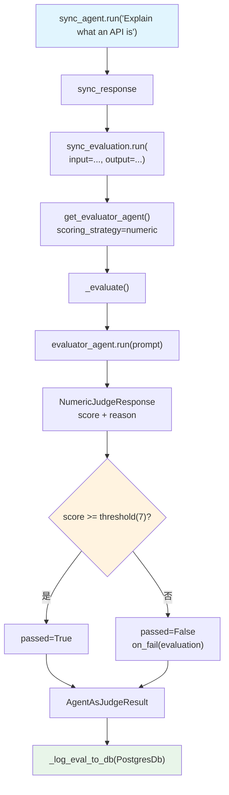

# agent_as_judge_basic.py — 实现原理分析

> 源文件：`cookbook/09_evals/agent_as_judge/agent_as_judge_basic.py`

## 概述

本示例展示 Agno **`AgentAsJudgeEval`** 的完整功能：使用 LLM 作为评判者（judge）对 Agent 输出按自定义标准打分，同时演示了同步（PostgreSQL）和异步（SQLite）两种 DB 存储模式，以及 `on_fail` 失败回调机制。

**核心配置一览（同步 + 异步两套）：**

| 配置项 | 同步评估 | 异步评估 |
|--------|---------|---------|
| `name` | `"Explanation Quality"` | `"ML Explanation Quality"` |
| `model` | 默认（gpt-5-mini） | `OpenAIChat(id="gpt-5.2")` |
| `criteria` | "Explanation should be clear, beginner-friendly, and use simple language" | "...avoid jargon" |
| `scoring_strategy` | `"numeric"` | `"numeric"` |
| `threshold` | `7` | `10` |
| `on_fail` | `on_evaluation_failure` 回调 | 同左 |
| `db` | `PostgresDb` | `AsyncSqliteDb` |

## 架构分层

```
用户代码层                      agno.eval 层
┌──────────────────────┐    ┌────────────────────────────────────────────┐
│ agent_as_judge_      │    │ AgentAsJudgeEval.run()                     │
│ basic.py             │    │  ├─ get_evaluator_agent() → judge          │
│                      │    │  │    criteria + scoring_strategy → prompt │
│ sync_evaluation.run( │───>│  ├─ _evaluate(input, output, evaluator)   │
│   input=...,         │    │  │    → evaluator_agent.run(prompt)       │
│   output=...,        │    │  │    → NumericJudgeResponse              │
│   print_results=True │    │  │    → score >= threshold? → passed      │
│ )                    │    │  │    → on_fail(evaluation) if not passed  │
│                      │    │  └─ _log_eval_to_db(...)                   │
└──────────────────────┘    └────────────────────────────────────────────┘
```

## 核心组件解析

### AgentAsJudgeEval 评判 Agent 构建

`get_evaluator_agent()`（`agent_as_judge.py:198`）根据 `scoring_strategy` 选择不同的输出 schema 和指令：

```python
# numeric 模式
response_schema = NumericJudgeResponse  # score: int(1-10), reason: str

return Agent(
    model=model,
    description="You are an expert evaluator. Score outputs objectively...",
    instructions="\n".join([
        "## Criteria", self.criteria, "",
        "## Scoring (1-10)", "- 1-2: Completely fails...", ...,
        "## Instructions", "1. Carefully evaluate...", "2. Provide a score from 1-10", ...
    ]),
    output_schema=NumericJudgeResponse,
)
```

### 评判输入格式

```python
# agent_as_judge.py:282-290
prompt = dedent(f"""\
    <input>
    {input}
    </input>

    <output>
    {output}
    </output>
""")
```

### on_fail 失败回调

```python
# score < threshold 时触发
if not passed and self.on_fail:
    self.on_fail(evaluation)  # 同步 callback
```

```python
def on_evaluation_failure(evaluation: AgentAsJudgeEvaluation):
    print(f"Evaluation failed - Score: {evaluation.score}/10")
    print(f"Reason: {evaluation.reason[:100]}...")
```

### DB 写入（同步 PostgreSQL）

```python
sync_db.get_eval_runs()  # 读取所有历史评估记录
```

## System Prompt 组装（评判 Agent）

| 组成部分 | 内容（numeric 模式） |
|---------|---------------------|
| `description` | "You are an expert evaluator. Score outputs objectively based on the provided criteria." |
| `## Criteria` | "Explanation should be clear, beginner-friendly, and use simple language" |
| `## Scoring (1-10)` | 1-10 分级说明 |
| `## Instructions` | 1. 评估 2. 给 1-10 分 3. 详细理由 |
| `output_schema` | `NumericJudgeResponse` |

## 完整 API 请求

**评判 Agent 调用（numeric 模式）**

```python
client.chat.completions.create(
    model="gpt-5.2",
    messages=[
        {"role": "system", "content": "You are an expert evaluator...\n## Criteria\nExplanation should be clear..."},
        {"role": "user", "content": "<input>\nExplain what an API is\n</input>\n\n<output>\n[Agent 实际输出]\n</output>"}
    ],
    response_format={"type": "json_schema", "json_schema": {"name": "NumericJudgeResponse", ...}},
    stream=False
)
# → {"score": 8, "reason": "The explanation is clear and beginner-friendly..."}
# → passed = (8 >= threshold=7) → True
```

## Mermaid 流程图



## 关键源码文件索引

| 文件 | 关键函数/类 | 作用 |
|------|------------|------|
| `agno/eval/agent_as_judge.py` | `AgentAsJudgeEval` L166 | Agent-as-Judge 评估 dataclass |
| `agno/eval/agent_as_judge.py` | `get_evaluator_agent()` L198 | 构建评判 Agent |
| `agno/eval/agent_as_judge.py` | `_evaluate()` L273 | 单次评判逻辑 |
| `agno/eval/agent_as_judge.py` | `run()` L467 | 同步运行入口 |
| `agno/eval/agent_as_judge.py` | `arun()` L573 | 异步运行入口 |
| `agno/eval/agent_as_judge.py` | `NumericJudgeResponse` L27 | 数值评判输出 schema |
| `agno/eval/agent_as_judge.py` | `BinaryJudgeResponse` L34 | 二值评判输出 schema |
