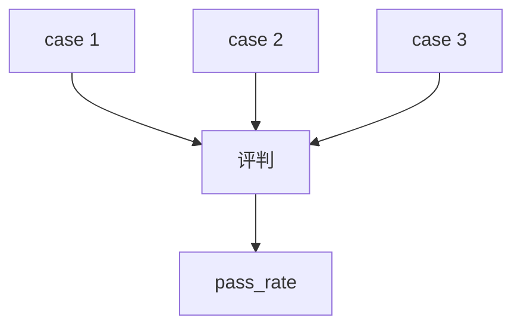

# agent_as_judge_batch.py — 实现原理分析

> 源文件：`cookbook/09_evals/agent_as_judge/agent_as_judge_batch.py`

## 概述

本示例用 **`evaluation.run(cases=[...])`** 一次评测多组 `input`/`output`（客服场景），`scoring_strategy="binary"`，并打印 `pass_rate` 与 `db.get_eval_runs()`。

**核心配置一览：**

| 配置项 | 值 | 说明 |
|--------|------|------|
| `criteria` | 共情、专业、有帮助 | 评判标准 |
| `db` | `SqliteDb` 临时库 | 存 eval 运行 |

## 核心组件解析

批量 cases 适合回归与数据集式评测；结果聚合在 `result.results` 与 `result.pass_rate`。

## System Prompt 组装

无独立被测 Agent；直接对给定 input/output 对评判（以 `AgentAsJudgeEval` 实现为准）。

## 完整 API 请求

评判模型多次或批处理（实现细节见 `agent_as_judge.py`）。

## Mermaid 流程图

## 关键源码文件索引

| 文件 | 作用 |
|------|------|
| `agno/eval/agent_as_judge.py` | `cases` 参数 |
