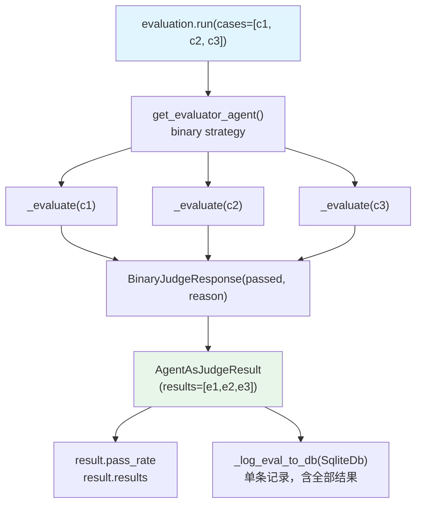

# agent_as_judge_batch.py — 实现原理分析

> 源文件：`cookbook/09_evals/agent_as_judge/agent_as_judge_batch.py`

## 概述

本示例展示 **`AgentAsJudgeEval` 的批量评估模式**：在一次 `run()` 调用中传入多个 `cases`，评估器对每个 `{input, output}` 对逐一调用 LLM 打分，并汇总 `pass_rate`。使用 `binary` 评判策略（PASSED/FAILED，无数值分数）。

**核心配置一览：**

| 配置项 | 值 | 说明 |
|--------|------|------|
| `name` | `"Customer Service Quality"` | 评估名称 |
| `criteria` | "Response should be empathetic, professional, and helpful" | 评判标准 |
| `scoring_strategy` | `"binary"` | PASSED/FAILED 二值判定 |
| `db` | `SqliteDb` | 批量结果持久化 |
| `cases` 数量 | 3 | 一次批量评估 3 个案例 |

## 核心组件解析

### batch 模式下的 run() 实现

`run()` 方法（`agent_as_judge.py:467`）支持两种调用方式：

```python
# 单次评估（single）
evaluation.run(input="...", output="...")

# 批量评估（batch）
evaluation.run(cases=[
    {"input": "...", "output": "..."},
    {"input": "...", "output": "..."},
    ...
])
```

内部逻辑：

```python
# agent_as_judge.py:510-530（简化）
all_results = []
for case in cases:
    evaluation = self._evaluate(
        input=case["input"],
        output=case["output"],
        evaluator_agent=evaluator_agent,
    )
    all_results.append(evaluation)
result = AgentAsJudgeResult(results=all_results)
```

### binary 策略的输出 schema

```python
class BinaryJudgeResponse(BaseModel):
    passed: bool      # True/False
    reason: str       # 判断理由
```

评判标准 prompt 中 scoring 部分替换为：
```
## Pass/Fail Criteria
- PASS: Response meets or exceeds the criteria
- FAIL: Response does not meet the criteria
```

### AgentAsJudgeResult 汇总统计

```python
result.pass_rate      # 通过率百分比（0-100）
result.results        # List[AgentAsJudgeEvaluation]
result.results[i].passed  # 单个案例是否通过
```

### DB 存储结构（批量模式）

批量评估仅写入**一条** DB 记录（`eval_id` 为单次 `run()` 的 ID），`eval_data["results"]` 包含所有 3 个案例的结果列表。

## Mermaid 流程图



## 关键源码文件索引

| 文件 | 关键函数/类 | 作用 |
|------|------------|------|
| `agno/eval/agent_as_judge.py` | `run()` L467 | 批量 cases 迭代评估 |
| `agno/eval/agent_as_judge.py` | `BinaryJudgeResponse` L34 | 二值判定输出 schema |
| `agno/eval/agent_as_judge.py` | `AgentAsJudgeResult` L81 | 汇总结果（含 pass_rate） |
