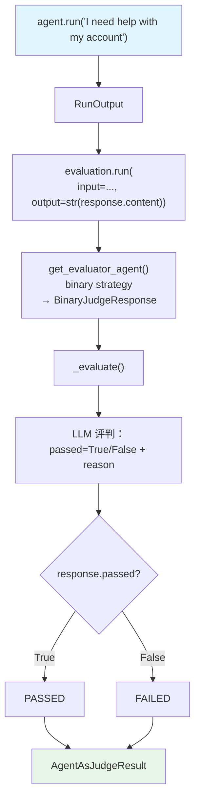

# agent_as_judge_binary.py — 实现原理分析

> 源文件：`cookbook/09_evals/agent_as_judge/agent_as_judge_binary.py`

## 概述

本示例展示 **`AgentAsJudgeEval` 的默认 `binary` 评判策略**：LLM 评判者对 Agent 输出返回 `PASSED` 或 `FAILED`（不给数值分数），适用于需要明确合规性检查的场景（如专业语气合规、内容审核等）。

**核心配置一览：**

| 配置项 | 值 | 说明 |
|--------|------|------|
| `name` | `"Professional Tone Check"` | 评估名称 |
| `criteria` | "Response must maintain professional tone without informal language or slang" | 评判标准 |
| `scoring_strategy` | `"binary"`（默认值） | 二值判定 |
| `threshold` | 未设置（binary 模式不需要） | N/A |
| `db` | `SqliteDb` | 同一个 DB 存储 Agent 历史和评估结果 |

## 核心组件解析

### binary 模式的评判 Agent 构建

`get_evaluator_agent()`（`agent_as_judge.py:198`）在 `scoring_strategy=="binary"` 时：

```python
response_schema = BinaryJudgeResponse  # passed: bool, reason: str

instructions_parts = [
    "## Criteria",
    self.criteria,  # "Response must maintain professional tone..."
    "",
    "## Pass/Fail Criteria",
    "- PASS: Response meets or exceeds the criteria",
    "- FAIL: Response does not meet the criteria",
    "",
    "## Instructions",
    "1. Carefully evaluate the output against the criteria",
    "2. Determine if the response PASSES or FAILS",
    "3. Provide a clear reason for your decision",
]
```

### binary 与 numeric 的关键区别

| 特性 | binary | numeric |
|------|--------|---------|
| 输出 schema | `BinaryJudgeResponse(passed, reason)` | `NumericJudgeResponse(score, reason)` |
| `threshold` 参数 | 无意义（忽略） | 必须设置 |
| `passed` 判定 | `response.passed == True` | `score >= threshold` |
| 使用场景 | 合规性/合格性检查 | 质量评分 |

### 同一 DB 共享模式

本例中 Agent 的历史存储和 Eval 的结果存储使用**同一个 `SqliteDb`**：

```python
db = SqliteDb(db_file="tmp/agent_as_judge_binary.db")
agent = Agent(..., db=db)
evaluation = AgentAsJudgeEval(..., db=db)
```

这允许通过单一 DB 文件同时查询对话历史和评估记录。

## Mermaid 流程图



## 关键源码文件索引

| 文件 | 关键函数/类 | 作用 |
|------|------------|------|
| `agno/eval/agent_as_judge.py` | `BinaryJudgeResponse` L34 | 二值判定输出 schema |
| `agno/eval/agent_as_judge.py` | `get_evaluator_agent()` L198 | binary 模式指令构建 |
| `agno/eval/agent_as_judge.py` | `_evaluate()` L273 | `response.passed` 直接用于判定 |
