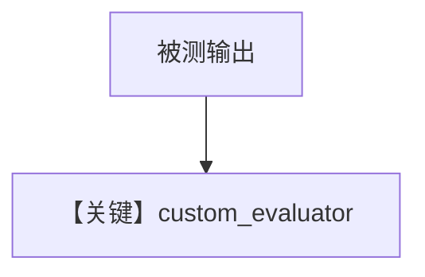

# agent_as_judge_custom_evaluator.py — 实现原理分析

<!-- cookbook-py-source:start -->
## 完整源码

```python
"""
Custom Evaluator Agent-as-Judge Evaluation
==========================================

Demonstrates using a custom evaluator agent for judging.
"""

from agno.agent import Agent
from agno.eval.agent_as_judge import AgentAsJudgeEval
from agno.models.openai import OpenAIChat

# ---------------------------------------------------------------------------
# Create Agent
# ---------------------------------------------------------------------------
agent = Agent(
    model=OpenAIChat(id="gpt-4o"),
    instructions="Explain technical concepts simply.",
)

# ---------------------------------------------------------------------------
# Create Evaluator Agent
# ---------------------------------------------------------------------------
custom_evaluator = Agent(
    model=OpenAIChat(id="gpt-4o"),
    description="Strict technical evaluator",
    instructions="You are a strict evaluator. Only give high scores to exceptionally clear and accurate explanations.",
)

# ---------------------------------------------------------------------------
# Create Evaluation
# ---------------------------------------------------------------------------
evaluation = AgentAsJudgeEval(
    name="Technical Accuracy",
    criteria="Explanation must be technically accurate and comprehensive",
    scoring_strategy="numeric",
    threshold=8,
    evaluator_agent=custom_evaluator,
)

# ---------------------------------------------------------------------------
# Run Evaluation
# ---------------------------------------------------------------------------
if __name__ == "__main__":
    response = agent.run("What is machine learning?")
    result = evaluation.run(
        input="What is machine learning?",
        output=str(response.content),
        print_results=True,
    )
    print(f"Score: {result.results[0].score}/10")
    print(f"Passed: {result.results[0].passed}")
```

<!-- cookbook-py-source:end -->

> 源文件：`cookbook/09_evals/agent_as_judge/agent_as_judge_custom_evaluator.py`

## 概述

本示例传入 **`evaluator_agent`**：独立 `Agent` 带 `description` 与 `instructions`，作为严格技术评判员。

**核心配置一览：**

| 配置项 | 值 | 说明 |
|--------|------|------|
| `custom_evaluator.description` | `"Strict technical evaluator"` | 进入 system 的描述段 `# 3.3.1` |
| `custom_evaluator.instructions` | 仅高分给极清晰准确解释 | 评判人格 |

### 还原 evaluator instructions

```text
You are a strict evaluator. Only give high scores to exceptionally clear and accurate explanations.
```

### 被测 agent instructions

```text
Explain technical concepts simply.
```

## 完整 API 请求

两轮 Chat Completions，评判使用自定义 Agent 的拼装结果。

## Mermaid 流程图



## 关键源码文件索引

| 文件 | 作用 |
|------|------|
| `agno/eval/agent_as_judge.py` | `evaluator_agent` |
