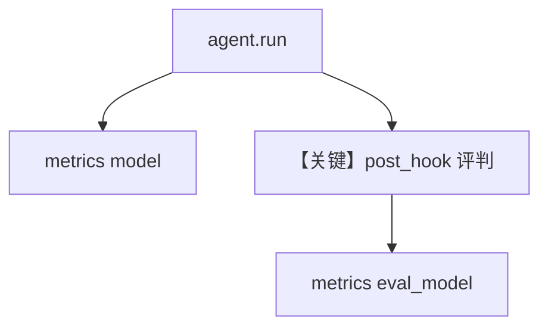

# agent_as_judge_eval_metrics.py — 实现原理分析

> 源文件：`cookbook/09_evals/agent_as_judge/agent_as_judge_eval_metrics.py`

## 概述

本示例将 **`AgentAsJudgeEval` 作为 `Agent.post_hooks`**：主 Agent 运行结束后自动评判，`run_output.metrics.details["eval_model"]` 累计评判 token，与 `accuracy_eval_metrics.py` 思想一致。

**核心配置一览：**

| 配置项 | 值 | 说明 |
|--------|------|------|
| `agent.post_hooks` | `[eval_hook]` | 后置钩子 |
| `eval_hook` | `binary` + `gpt-4o-mini` | 评判 |

### 还原 agent instructions

```text
Answer questions concisely.
```

## 完整 API 请求

单次 `agent.run` 触发主模型 + 钩子内评判模型。

## Mermaid 流程图



## 关键源码文件索引

| 文件 | 作用 |
|------|------|
| `agno/agent/agent.py` | `post_hooks` |
| `agno/eval/agent_as_judge.py` | 钩子接口 |
