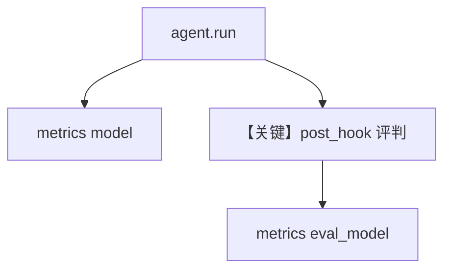

# agent_as_judge_eval_metrics.py — 实现原理分析

<!-- cookbook-py-source:start -->
## 完整源码

```python
"""
Agent-as-Judge Eval Metrics
============================

Demonstrates that eval model metrics are accumulated back into the
original agent's run_output when AgentAsJudgeEval is used as a post_hook.

After the agent runs, the evaluator agent makes its own model call.
Those eval tokens show up under "eval_model" in run_output.metrics.details.
"""

from agno.agent import Agent
from agno.eval.agent_as_judge import AgentAsJudgeEval
from agno.models.openai import OpenAIChat
from rich.pretty import pprint

# ---------------------------------------------------------------------------
# Create eval as a post-hook
# ---------------------------------------------------------------------------
eval_hook = AgentAsJudgeEval(
    name="Quality Check",
    model=OpenAIChat(id="gpt-4o-mini"),
    criteria="Response should be accurate, clear, and concise",
    scoring_strategy="binary",
)

agent = Agent(
    model=OpenAIChat(id="gpt-4o-mini"),
    instructions="Answer questions concisely.",
    post_hooks=[eval_hook],
)

# ---------------------------------------------------------------------------
# Run
# ---------------------------------------------------------------------------
if __name__ == "__main__":
    result = agent.run("What is the capital of France?")

    # The run metrics now include both agent model + eval model tokens
    if result.metrics:
        print("Total tokens (agent + eval):", result.metrics.total_tokens)

        if result.metrics.details:
            # Agent's own model call
            if "model" in result.metrics.details:
                agent_tokens = sum(
                    metric.total_tokens for metric in result.metrics.details["model"]
                )
                print("Agent model tokens:", agent_tokens)

            # Eval model call (accumulated from evaluator agent)
            if "eval_model" in result.metrics.details:
                eval_tokens = sum(
                    metric.total_tokens
                    for metric in result.metrics.details["eval_model"]
                )
                print("Eval model tokens:", eval_tokens)
                for metric in result.metrics.details["eval_model"]:
                    print(f"  Evaluator: {metric.id} ({metric.provider})")

            print("\nFull metrics details:")
            pprint(result.metrics.to_dict())
```

<!-- cookbook-py-source:end -->

> 源文件：`cookbook/09_evals/agent_as_judge/agent_as_judge_eval_metrics.py`

## 概述

本示例将 **`AgentAsJudgeEval` 作为 `Agent.post_hooks`**：主 Agent 运行结束后自动评判，`run_output.metrics.details["eval_model"]` 累计评判 token，与 `accuracy_eval_metrics.py` 思想一致。

**核心配置一览：**

| 配置项 | 值 | 说明 |
|--------|------|------|
| `agent.post_hooks` | `[eval_hook]` | 后置钩子 |
| `eval_hook` | `binary` + `gpt-4o-mini` | 评判 |

### 还原 agent instructions

```text
Answer questions concisely.
```

## 完整 API 请求

单次 `agent.run` 触发主模型 + 钩子内评判模型。

## Mermaid 流程图



## 关键源码文件索引

| 文件 | 作用 |
|------|------|
| `agno/agent/agent.py` | `post_hooks` |
| `agno/eval/agent_as_judge.py` | 钩子接口 |
