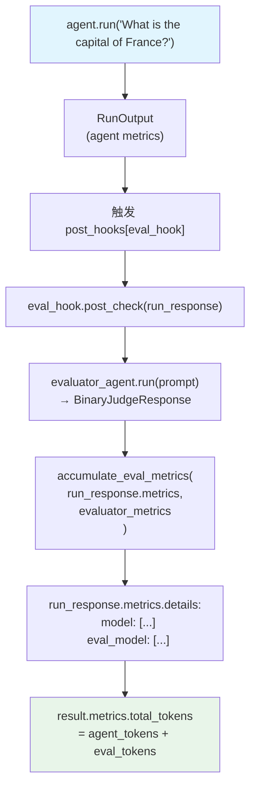

# agent_as_judge_eval_metrics.py — 实现原理分析

> 源文件：`cookbook/09_evals/agent_as_judge/agent_as_judge_eval_metrics.py`

## 概述

本示例展示 **`AgentAsJudgeEval` 作为 `post_hook` 时的 metrics 累积机制**：评判 Agent 的 token 消耗会被合并到主 Agent 的 `run_output.metrics` 中，以 `eval_model` 键区分，实现统一的 token 用量审计。

**核心配置一览：**

| 配置项 | 值 | 说明 |
|--------|------|------|
| `eval_hook.model` | `OpenAIChat(id="gpt-4o-mini")` | 评判 LLM（轻量） |
| `agent.model` | `OpenAIChat(id="gpt-4o-mini")` | 主 Agent LLM |
| `scoring_strategy` | `"binary"` | 二值判定 |
| 注册方式 | `Agent(post_hooks=[eval_hook])` | 自动触发 |

## 核心组件解析

### metrics 累积机制

当 `AgentAsJudgeEval` 作为 `post_hook` 执行时，`post_check()` 内部调用 `accumulate_eval_metrics()`：

```python
# agent_as_judge.py:870-880（简化）
def post_check(self, run_response, *args, **kwargs):
    evaluation = self._evaluate(
        input=..., output=...,
        evaluator_agent=evaluator_agent,
    )
    # 将评判 Agent 的 metrics 合并进主 run_response.metrics
    if run_response.metrics and evaluation.metrics:
        from agno.metrics import accumulate_eval_metrics
        accumulate_eval_metrics(run_response.metrics, evaluation.metrics)
```

合并后的 `metrics.details` 结构：

```python
{
    "model": [ModelMetric(...)],      # 主 Agent 的调用记录
    "eval_model": [ModelMetric(...)], # 评判 Agent 的调用记录（新增）
}
```

### metrics 读取路径

```python
result = agent.run("What is the capital of France?")

# 合计 tokens（主 + 评判）
result.metrics.total_tokens  # = agent_tokens + eval_tokens

# 分离查看
result.metrics.details["model"]      # 主 Agent 调用
result.metrics.details["eval_model"] # 评判 Agent 调用
```

### 与 AccuracyEval metrics 累积的对比

两者机制完全相同，均使用 `accumulate_eval_metrics()`，区别仅在触发时机：

| 类型 | 触发时机 | metrics 写入位置 |
|------|---------|-----------------|
| `AccuracyEval` | `evaluate_answer()` 内 | `run_metrics`（传入参数） |
| `AgentAsJudgeEval` | `post_check()` 内 | `run_response.metrics`（直接修改） |

## Mermaid 流程图



## 关键源码文件索引

| 文件 | 关键函数/类 | 作用 |
|------|------------|------|
| `agno/eval/agent_as_judge.py` | `post_check()` L841 | post_hook + metrics 累积 |
| `agno/metrics/__init__.py` | `accumulate_eval_metrics()` | 合并 eval_model metrics |
| `agno/eval/accuracy.py` | `evaluate_answer()` L291 | 对比：AccuracyEval 的相同机制 |
