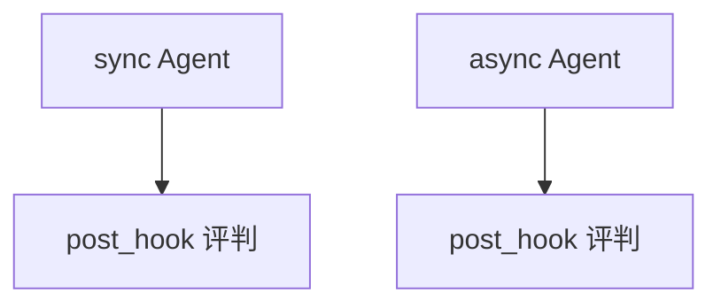

# agent_as_judge_post_hook.py — 实现原理分析

> 源文件：`cookbook/09_evals/agent_as_judge/agent_as_judge_post_hook.py`

## 概述

本示例对比 **同步 `SqliteDb` 与异步 `AsyncSqliteDb`** 下的 `post_hooks` 评判；`AgentAsJudgeEval` 带 `db` 持久化评测记录。

**核心配置一览：**

| 配置项 | 值 | 说明 |
|--------|------|------|
| `sync_agent` / `async_agent` | `post_hooks=[...AgentAsJudgeEval]` | 同构 |
| `criteria` | 专业、结构、平衡观点 | 同步与异步文案略异 |

### 还原被测 instructions

```text
Provide professional and well-reasoned answers.
```

## 完整 API 请求

同步 `run` 与 `asyncio` 下 `arun` 两套路径。

## Mermaid 流程图



## 关键源码文件索引

| 文件 | 作用 |
|------|------|
| `agno/eval/agent_as_judge.py` | 异步 `arun` |
