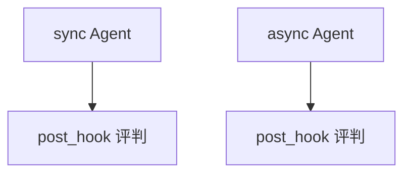

# agent_as_judge_post_hook.py — 实现原理分析

<!-- cookbook-py-source:start -->
## 完整源码

```python
"""
Post-Hook Agent-as-Judge Evaluation
===================================

Demonstrates synchronous and asynchronous post-hook judging.
"""

import asyncio

from agno.agent import Agent
from agno.db.sqlite import AsyncSqliteDb, SqliteDb
from agno.eval.agent_as_judge import AgentAsJudgeEval
from agno.models.openai import OpenAIChat

# ---------------------------------------------------------------------------
# Create Sync Resources
# ---------------------------------------------------------------------------
sync_db = SqliteDb(db_file="tmp/agent_as_judge_post_hook.db")

sync_agent_as_judge_eval = AgentAsJudgeEval(
    name="Response Quality Check",
    model=OpenAIChat(id="gpt-5.2"),
    criteria="Response should be professional, well-structured, and provide balanced perspectives",
    scoring_strategy="numeric",
    threshold=7,
    db=sync_db,
)

sync_agent = Agent(
    model=OpenAIChat(id="gpt-4o"),
    instructions="Provide professional and well-reasoned answers.",
    post_hooks=[sync_agent_as_judge_eval],
    db=sync_db,
)

# ---------------------------------------------------------------------------
# Create Async Resources
# ---------------------------------------------------------------------------
async_db = AsyncSqliteDb(db_file="tmp/agent_as_judge_post_hook_async.db")

async_agent_as_judge_eval = AgentAsJudgeEval(
    name="Response Quality Check",
    model=OpenAIChat(id="gpt-5.2"),
    criteria="Response should be professional, well-balanced, and provide evidence-based perspectives",
    scoring_strategy="numeric",
    threshold=7,
    db=async_db,
)

async_agent = Agent(
    model=OpenAIChat(id="gpt-4o"),
    instructions="Provide professional and well-reasoned answers.",
    post_hooks=[async_agent_as_judge_eval],
    db=async_db,
)


def print_latest_result(eval_runs):
    if eval_runs:
        latest = eval_runs[-1]
        if latest.eval_data and "results" in latest.eval_data:
            result = latest.eval_data["results"][0]
            print(f"Score: {result.get('score', 'N/A')}/10")
            print(f"Status: {'PASSED' if result.get('passed') else 'FAILED'}")
            print(f"Reason: {result.get('reason', 'N/A')[:200]}...")


async def run_async_evaluation():
    async_response = await async_agent.arun(
        "What are the benefits of renewable energy?"
    )
    print(async_response.content)

    print("Async Evaluation Results:")
    async_eval_runs = await async_db.get_eval_runs()
    print_latest_result(async_eval_runs)


# ---------------------------------------------------------------------------
# Run Evaluation
# ---------------------------------------------------------------------------
if __name__ == "__main__":
    sync_response = sync_agent.run("What are the benefits of renewable energy?")
    print(sync_response.content)

    print("Evaluation Results:")
    sync_eval_runs = sync_db.get_eval_runs()
    print_latest_result(sync_eval_runs)

    asyncio.run(run_async_evaluation())
```

<!-- cookbook-py-source:end -->

> 源文件：`cookbook/09_evals/agent_as_judge/agent_as_judge_post_hook.py`

## 概述

本示例对比 **同步 `SqliteDb` 与异步 `AsyncSqliteDb`** 下的 `post_hooks` 评判；`AgentAsJudgeEval` 带 `db` 持久化评测记录。

**核心配置一览：**

| 配置项 | 值 | 说明 |
|--------|------|------|
| `sync_agent` / `async_agent` | `post_hooks=[...AgentAsJudgeEval]` | 同构 |
| `criteria` | 专业、结构、平衡观点 | 同步与异步文案略异 |

### 还原被测 instructions

```text
Provide professional and well-reasoned answers.
```

## 完整 API 请求

同步 `run` 与 `asyncio` 下 `arun` 两套路径。

## Mermaid 流程图



## 关键源码文件索引

| 文件 | 作用 |
|------|------|
| `agno/eval/agent_as_judge.py` | 异步 `arun` |
