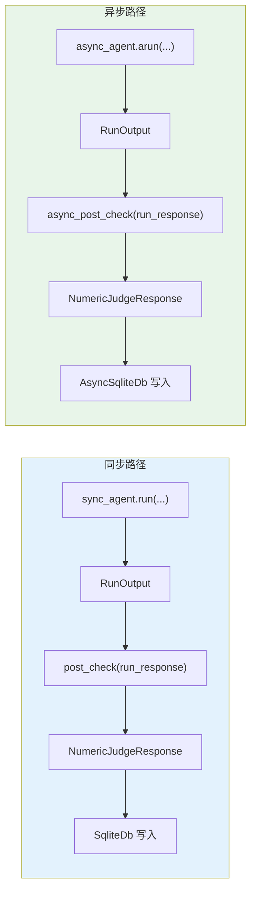

# agent_as_judge_post_hook.py — 实现原理分析

> 源文件：`cookbook/09_evals/agent_as_judge/agent_as_judge_post_hook.py`

## 概述

本示例展示 **`AgentAsJudgeEval` 作为 Agent `post_hook`** 的完整场景，包含同步（`SqliteDb` + `agent.run()`）和异步（`AsyncSqliteDb` + `agent.arun()`）两套配置，以及相应的 `post_check()` 和 `async_post_check()` 触发路径。

**核心配置对比：**

| 配置项 | 同步版 | 异步版 |
|--------|-------|-------|
| `db` | `SqliteDb` | `AsyncSqliteDb` |
| `agent` 方法 | `sync_agent.run()` | `async_agent.arun()` |
| `post_hook` 触发 | `post_check()` | `async_post_check()` |
| `db.get_eval_runs()` | 同步调用 | `await async_db.get_eval_runs()` |
| `scoring_strategy` | `"numeric"` | `"numeric"` |
| `threshold` | `7` | `7` |

## 核心组件解析

### post_hook 触发路径（同步 vs 异步）

**同步路径：**

```python
# Agent 运行结束后，框架调用：
for hook in self.post_hooks:
    hook.post_check(run_response, ...)
```

**异步路径：**

```python
# Agent arun() 结束后，框架调用：
for hook in self.post_hooks:
    await hook.async_post_check(run_response, ...)
```

`async_post_check()`（`agent_as_judge.py:887`）内部使用 `async` 版本的 evaluator 调用：

```python
async def async_post_check(self, run_response, *args, **kwargs):
    evaluator = self.get_evaluator_agent()
    eval_result = await evaluator.arun(prompt)
    # ... 异步写 DB
    await self._async_log_eval_to_db(result)
```

### AsyncSqliteDb vs SqliteDb

`AsyncSqliteDb` 提供异步 `await` 接口，内部使用 `aiosqlite`，适用于 `asyncio` 事件循环中：

```python
# 异步读取评估结果
async_eval_runs = await async_db.get_eval_runs()
```

## Mermaid 流程图



## 关键源码文件索引

| 文件 | 关键函数/类 | 作用 |
|------|------------|------|
| `agno/eval/agent_as_judge.py` | `post_check()` L841 | 同步 post_hook |
| `agno/eval/agent_as_judge.py` | `async_post_check()` L887 | 异步 post_hook |
| `agno/db/sqlite.py` | `AsyncSqliteDb` | 异步 SQLite 存储 |
