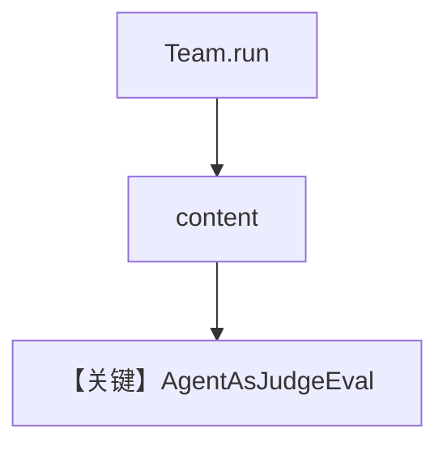

# agent_as_judge_team.py — 实现原理分析

> 源文件：`cookbook/09_evals/agent_as_judge/agent_as_judge_team.py`

## 概述

本示例对 **`Team.run` 的最终输出** 做 Agent-as-Judge：`research_team` 含 Researcher + Writer，评判 `criteria` 关注调研与行文质量。

**核心配置一览：**

| 配置项 | 值 | 说明 |
|--------|------|------|
| `Team.instructions` | 先研究再写摘要 | 协调器 |
| `evaluation.run` | `input`/`output` 来自 `research_team.run` | 评 Team 文本 |

### 还原 Team instructions

```text
First research the topic thoroughly, then write a clear summary.
```

## 完整 API 请求

Team 内部多轮成员调用 + 评判一次。

## Mermaid 流程图



## 关键源码文件索引

| 文件 | 作用 |
|------|------|
| `agno/team/team.py` | `run` |
| `agno/eval/agent_as_judge.py` | 评判 |
