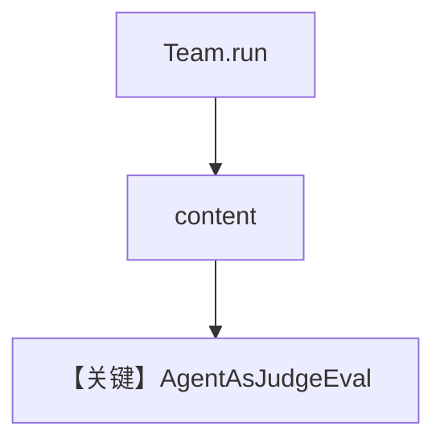

# agent_as_judge_team.py — 实现原理分析

<!-- cookbook-py-source:start -->
## 完整源码

```python
"""
Team Agent-as-Judge Evaluation
==============================

Demonstrates response quality evaluation for team outputs.
"""

from typing import Optional

from agno.agent import Agent
from agno.db.sqlite import SqliteDb
from agno.eval.agent_as_judge import AgentAsJudgeEval, AgentAsJudgeResult
from agno.models.openai import OpenAIChat
from agno.team.team import Team

# ---------------------------------------------------------------------------
# Create Database
# ---------------------------------------------------------------------------
db = SqliteDb(db_file="tmp/agent_as_judge_team.db")

# ---------------------------------------------------------------------------
# Create Team
# ---------------------------------------------------------------------------
researcher = Agent(
    name="Researcher",
    role="Research and gather information",
    model=OpenAIChat(id="gpt-4o"),
)
writer = Agent(
    name="Writer",
    role="Write clear and concise summaries",
    model=OpenAIChat(id="gpt-4o"),
)
research_team = Team(
    name="Research Team",
    model=OpenAIChat("gpt-4o"),
    members=[researcher, writer],
    instructions=["First research the topic thoroughly, then write a clear summary."],
    db=db,
)

# ---------------------------------------------------------------------------
# Create Evaluation
# ---------------------------------------------------------------------------
evaluation = AgentAsJudgeEval(
    name="Team Response Quality",
    model=OpenAIChat(id="gpt-5.2"),
    criteria="Response should be well-researched, clear, and comprehensive with good flow",
    scoring_strategy="binary",
    db=db,
)

# ---------------------------------------------------------------------------
# Run Evaluation
# ---------------------------------------------------------------------------
if __name__ == "__main__":
    response = research_team.run("Explain quantum computing")
    result: Optional[AgentAsJudgeResult] = evaluation.run(
        input="Explain quantum computing",
        output=str(response.content),
        print_results=True,
        print_summary=True,
    )
    assert result is not None, "Evaluation should return a result"

    print("Database Results:")
    eval_runs = db.get_eval_runs()
    print(f"Total evaluations stored: {len(eval_runs)}")
    if eval_runs:
        latest = eval_runs[-1]
        print(f"Eval ID: {latest.run_id}")
        print(f"Team: {research_team.name}")
```

<!-- cookbook-py-source:end -->

> 源文件：`cookbook/09_evals/agent_as_judge/agent_as_judge_team.py`

## 概述

本示例对 **`Team.run` 的最终输出** 做 Agent-as-Judge：`research_team` 含 Researcher + Writer，评判 `criteria` 关注调研与行文质量。

**核心配置一览：**

| 配置项 | 值 | 说明 |
|--------|------|------|
| `Team.instructions` | 先研究再写摘要 | 协调器 |
| `evaluation.run` | `input`/`output` 来自 `research_team.run` | 评 Team 文本 |

### 还原 Team instructions

```text
First research the topic thoroughly, then write a clear summary.
```

## 完整 API 请求

Team 内部多轮成员调用 + 评判一次。

## Mermaid 流程图



## 关键源码文件索引

| 文件 | 作用 |
|------|------|
| `agno/team/team.py` | `run` |
| `agno/eval/agent_as_judge.py` | 评判 |
