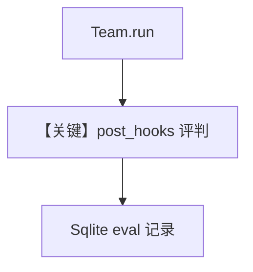

# agent_as_judge_team_post_hook.py — 实现原理分析

> 源文件：`cookbook/09_evals/agent_as_judge/agent_as_judge_team_post_hook.py`

## 概述

本示例将 **`AgentAsJudgeEval` 挂在 `Team.post_hooks`**：Team 完成 `run` 后自动评分并写入 `db`；脚本从 `get_eval_runs()` 解析 `eval_data["results"][0]`。

**核心配置一览：**

| 配置项 | 值 | 说明 |
|--------|------|------|
| `research_team.post_hooks` | `[agent_as_judge_eval]` | Team 级钩子 |
| `scoring_strategy` | `numeric`，`threshold=7` | — |

## 完整 API 请求

Team 执行链 + 钩子内评判。

## Mermaid 流程图

## 关键源码文件索引

| 文件 | 作用 |
|------|------|
| `agno/team/team.py` | `post_hooks` |
