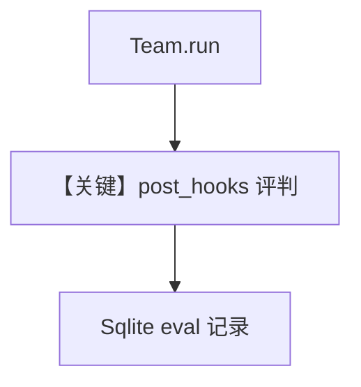

# agent_as_judge_team_post_hook.py — 实现原理分析

<!-- cookbook-py-source:start -->
## 完整源码

```python
"""
Team Post-Hook Agent-as-Judge Evaluation
========================================

Demonstrates a post-hook judge running on team responses.
"""

from agno.agent import Agent
from agno.db.sqlite import SqliteDb
from agno.eval.agent_as_judge import AgentAsJudgeEval
from agno.models.openai import OpenAIChat
from agno.team.team import Team

# ---------------------------------------------------------------------------
# Create Database
# ---------------------------------------------------------------------------
db = SqliteDb(db_file="tmp/agent_as_judge_team_post_hook.db")

# ---------------------------------------------------------------------------
# Create Team and Evaluation Hook
# ---------------------------------------------------------------------------
agent_as_judge_eval = AgentAsJudgeEval(
    name="Team Response Quality",
    model=OpenAIChat(id="gpt-5.2"),
    criteria="Response should be well-researched, clear, comprehensive, and show good collaboration between team members",
    scoring_strategy="numeric",
    threshold=7,
    db=db,
)
researcher = Agent(
    name="Researcher",
    role="Research and gather information",
    model=OpenAIChat(id="gpt-4o"),
)
writer = Agent(
    name="Writer",
    role="Write clear and concise summaries",
    model=OpenAIChat(id="gpt-4o"),
)
research_team = Team(
    name="Research Team",
    model=OpenAIChat("gpt-4o"),
    members=[researcher, writer],
    instructions=["First research the topic thoroughly, then write a clear summary."],
    post_hooks=[agent_as_judge_eval],
    db=db,
)

# ---------------------------------------------------------------------------
# Run Evaluation
# ---------------------------------------------------------------------------
if __name__ == "__main__":
    response = research_team.run("Explain quantum computing")
    print(response.content)

    print("Evaluation Results:")
    eval_runs = db.get_eval_runs()
    if eval_runs:
        latest = eval_runs[-1]
        if latest.eval_data and "results" in latest.eval_data:
            result = latest.eval_data["results"][0]
            print(f"Score: {result.get('score', 'N/A')}/10")
            print(f"Status: {'PASSED' if result.get('passed') else 'FAILED'}")
            print(f"Reason: {result.get('reason', 'N/A')[:200]}...")
```

<!-- cookbook-py-source:end -->

> 源文件：`cookbook/09_evals/agent_as_judge/agent_as_judge_team_post_hook.py`

## 概述

本示例将 **`AgentAsJudgeEval` 挂在 `Team.post_hooks`**：Team 完成 `run` 后自动评分并写入 `db`；脚本从 `get_eval_runs()` 解析 `eval_data["results"][0]`。

**核心配置一览：**

| 配置项 | 值 | 说明 |
|--------|------|------|
| `research_team.post_hooks` | `[agent_as_judge_eval]` | Team 级钩子 |
| `scoring_strategy` | `numeric`，`threshold=7` | — |

## 完整 API 请求

Team 执行链 + 钩子内评判。

## Mermaid 流程图



## 关键源码文件索引

| 文件 | 作用 |
|------|------|
| `agno/team/team.py` | `post_hooks` |
