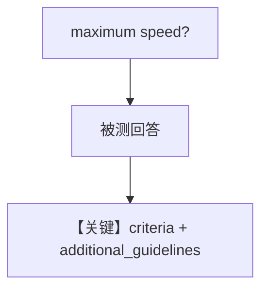

# agent_as_judge_with_guidelines.py — 实现原理分析

<!-- cookbook-py-source:start -->
## 完整源码

```python
"""
Guideline-Based Agent-as-Judge Evaluation
=========================================

Demonstrates agent-as-judge scoring with additional guidelines.
"""

from typing import Optional

from agno.agent import Agent
from agno.db.sqlite import SqliteDb
from agno.eval.agent_as_judge import AgentAsJudgeEval, AgentAsJudgeResult
from agno.models.openai import OpenAIChat

# ---------------------------------------------------------------------------
# Create Database
# ---------------------------------------------------------------------------
db = SqliteDb(db_file="tmp/agent_as_judge_guidelines.db")

# ---------------------------------------------------------------------------
# Create Agent
# ---------------------------------------------------------------------------
agent = Agent(
    model=OpenAIChat(id="gpt-4o"),
    instructions="You are a Tesla Model 3 product specialist. Provide detailed and helpful specifications.",
    db=db,
)

# ---------------------------------------------------------------------------
# Create Evaluation
# ---------------------------------------------------------------------------
evaluation = AgentAsJudgeEval(
    name="Product Info Quality",
    model=OpenAIChat(id="gpt-5.2"),
    criteria="Response should be informative, well-formatted, and accurate for product specifications",
    scoring_strategy="numeric",
    threshold=8,
    additional_guidelines=[
        "Must include specific numbers with proper units (mph, km/h, etc.)",
        "Should provide context for different model variants if applicable",
        "Information should be technically accurate and complete",
    ],
    db=db,
)

# ---------------------------------------------------------------------------
# Run Evaluation
# ---------------------------------------------------------------------------
if __name__ == "__main__":
    response = agent.run("What is the maximum speed of the Tesla Model 3?")
    result: Optional[AgentAsJudgeResult] = evaluation.run(
        input="What is the maximum speed?",
        output=str(response.content),
        print_results=True,
    )
    assert result is not None, "Evaluation should return a result"

    print("Database Results:")
    eval_runs = db.get_eval_runs()
    print(f"Total evaluations stored: {len(eval_runs)}")
    if eval_runs:
        latest = eval_runs[-1]
        print(f"Eval ID: {latest.run_id}")
        print(f"Additional guidelines used: {len(evaluation.additional_guidelines)}")
```

<!-- cookbook-py-source:end -->

> 源文件：`cookbook/09_evals/agent_as_judge/agent_as_judge_with_guidelines.py`

## 概述

本示例演示 **`additional_guidelines`** 列表：在 `criteria` 之外附加细则（单位、变体、技术完整性），评测 Tesla Model 3 规格类回答。

**核心配置一览：**

| 配置项 | 值 | 说明 |
|--------|------|------|
| `agent.instructions` | Tesla Model 3 产品专家 | 被测 |
| `additional_guidelines` | 三条关于数字单位、变体、准确性 | 评判细则 |

### 还原 agent instructions

```text
You are a Tesla Model 3 product specialist. Provide detailed and helpful specifications.
```

## 完整 API 请求

被测回答极速/规格 → 评判模型按准则+细则打分。

## Mermaid 流程图



## 关键源码文件索引

| 文件 | 作用 |
|------|------|
| `agno/eval/agent_as_judge.py` | `additional_guidelines` |
