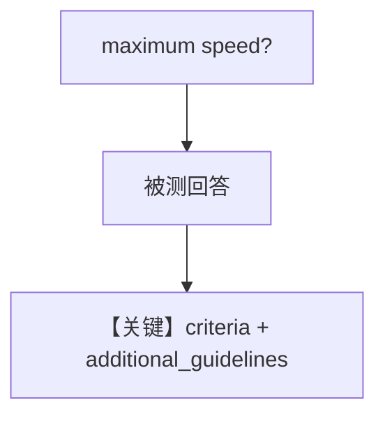

# agent_as_judge_with_guidelines.py — 实现原理分析

> 源文件：`cookbook/09_evals/agent_as_judge/agent_as_judge_with_guidelines.py`

## 概述

本示例演示 **`additional_guidelines`** 列表：在 `criteria` 之外附加细则（单位、变体、技术完整性），评测 Tesla Model 3 规格类回答。

**核心配置一览：**

| 配置项 | 值 | 说明 |
|--------|------|------|
| `agent.instructions` | Tesla Model 3 产品专家 | 被测 |
| `additional_guidelines` | 三条关于数字单位、变体、准确性 | 评判细则 |

### 还原 agent instructions

```text
You are a Tesla Model 3 product specialist. Provide detailed and helpful specifications.
```

## 完整 API 请求

被测回答极速/规格 → 评判模型按准则+细则打分。

## Mermaid 流程图



## 关键源码文件索引

| 文件 | 作用 |
|------|------|
| `agno/eval/agent_as_judge.py` | `additional_guidelines` |
