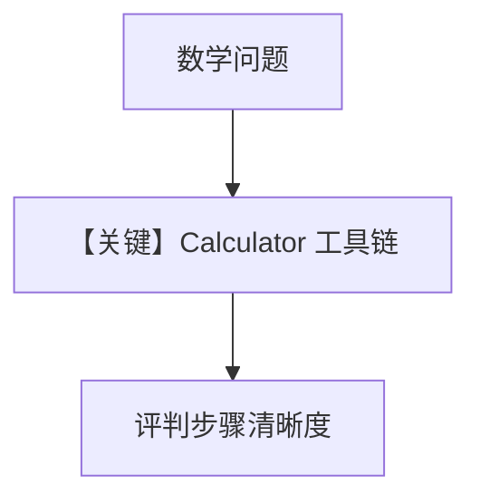

# agent_as_judge_with_tools.py — 实现原理分析

> 源文件：`cookbook/09_evals/agent_as_judge/agent_as_judge_with_tools.py`

## 概述

本示例评测 **带计算器工具** 的 Agent：`criteria` 强调展示中间步骤与最终答案可读性。

**核心配置一览：**

| 配置项 | 值 | 说明 |
|--------|------|------|
| `tools` | `[CalculatorTools()]` | 被测 |
| `instructions` | 必须用计算器并展示步骤 | 被测 |

### 还原 instructions

```text
Use the calculator tools to solve math problems. Explain your reasoning and show calculation steps clearly.
```

## 完整 API 请求

`chat.completions` + tools 循环直至文本答案，再送评判。

## Mermaid 流程图



## 关键源码文件索引

| 文件 | 作用 |
|------|------|
| `agno/tools/calculator` | 算术工具 |
