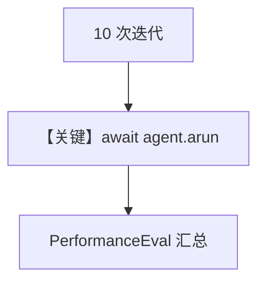

# async_function.py — 实现原理分析

> 源文件：`cookbook/09_evals/performance/async_function.py`

## 概述

本示例用 **`PerformanceEval(func=arun_agent, num_iterations=10)`** 测量 **异步函数** `arun_agent` 的耗时：`await agent.arun(...)`，内部 `Agent` 使用 `system_message` 短答约束。

**核心配置一览：**

| 配置项 | 值 | 说明 |
|--------|------|------|
| `system_message` | `"Be concise, reply with one sentence."` | 早退或覆盖默认拼装时需看是否传入 `system_message` 参数（本例直接构造 Message 等价路径见 Agent 实现） |
| `model` | `OpenAIChat(id="gpt-5.2")` | 异步 `arun` |
| `PerformanceEval` | `arun(print_summary=True)` | 异步评测入口 |

### 还原 system_message 字符串

```text
Be concise, reply with one sentence.
```

## 核心组件解析

`PerformanceEval.arun` 多次执行协程，统计延迟分布（见 `agno/eval/performance.py`）。

## 完整 API 请求

`OpenAIChat.ainvoke` / 异步 Chat Completions。

## Mermaid 流程图



## 关键源码文件索引

| 文件 | 作用 |
|------|------|
| `agno/eval/performance.py` | `PerformanceEval` |
