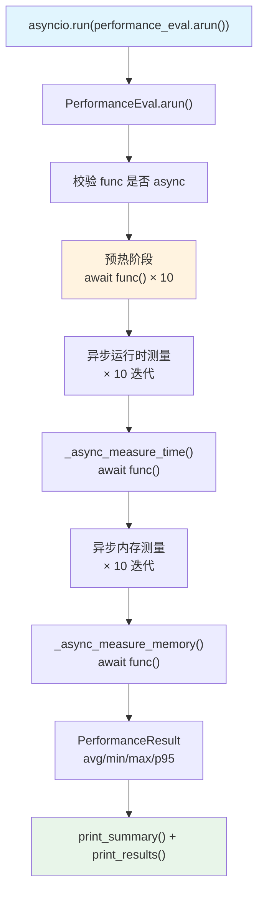

# async_function.py — 实现原理分析

> 源文件：`cookbook/09_evals/performance/async_function.py`

## 概述

本示例展示 **`PerformanceEval.arun()`** 对**异步函数**的性能基准测试：使用 `asyncio.run()` 驱动 `arun()` 方法，测量异步 Agent 响应的运行时和内存，迭代 10 次统计。

**核心配置一览：**

| 配置项 | 值 | 说明 |
|--------|------|------|
| `func` | `arun_agent`（async 函数） | 被测异步函数 |
| `num_iterations` | `10` | 测量迭代次数 |
| `warmup_runs` | `10`（默认） | 预热 10 次 |
| `name` | `None` | 未设置 |
| `db` | `None` | 不持久化 |

## 架构分层

```
用户代码层                      agno.eval 层
┌──────────────────────┐    ┌──────────────────────────────────────────────┐
│ async_function.py    │    │ PerformanceEval.arun()（async）               │
│                      │    │  ├─ 校验 func 是否为 async（否则抛出）        │
│ asyncio.run(         │───>│  ├─ 1. warmup_runs=10 预热                   │
│   performance_eval   │    │  │    await self.func() × 10                 │
│   .arun(...)         │    │  ├─ 2. 异步运行时测量 × 10                   │
│ )                    │    │  │    _async_measure_time()                   │
│                      │    │  ├─ 3. 异步内存测量 × 10                     │
│                      │    │  │    _async_measure_memory()                 │
└──────────────────────┘    └──────────────────────────────────────────────┘
```

## 核心组件解析

### arun() 异步验证

`arun()` 首先校验 `func` 必须为协程函数（`performance.py:638-641`）：

```python
async def arun(self, ...) -> PerformanceResult:
    if not asyncio.iscoroutinefunction(self.func):
        raise ValueError(
            f"The provided function ({self.func.__name__}) is not async. Use run() for sync functions."
        )
```

### 异步运行时测量

`_async_measure_time()`（`performance.py:243`）：

```python
async def _async_measure_time(self) -> float:
    timer = Timer()
    timer.start()
    await self.func()    # await 异步函数
    timer.stop()
    return timer.elapsed
```

### 异步内存测量

`_async_measure_memory()`（`performance.py:310`）：

```python
async def _async_measure_memory(self, baseline: float) -> float:
    gc.collect()
    tracemalloc.start()
    await self.func()   # await 异步函数
    current, peak = tracemalloc.get_traced_memory()
    tracemalloc.stop()
    return max(0, peak / 1024 / 1024 - baseline)
```

### 预热机制（warmup_runs=10 默认）

```python
# 预热运行不计入统计
for i in range(self.warmup_runs):
    await self.func()  # 简单调用，不计时/计内存
```

预热目的：使 Python 解释器、网络连接池、模型 SDK 等完成初始化，避免首次调用冷启动开销影响统计。

## Mermaid 流程图



## 关键源码文件索引

| 文件 | 关键函数/类 | 作用 |
|------|------------|------|
| `agno/eval/performance.py` | `arun()` L624 | 异步测量主流程 |
| `agno/eval/performance.py` | `_async_measure_time()` L243 | 异步运行时测量 |
| `agno/eval/performance.py` | `_async_measure_memory()` L310 | 异步内存测量 |
