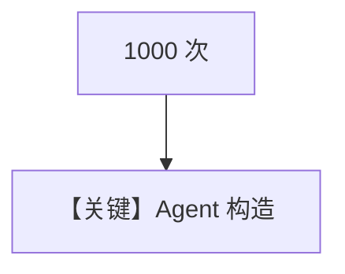

# instantiate_agent.py — 实现原理分析

> 源文件：`cookbook/09_evals/performance/instantiate_agent.py`

## 概述

本示例测量 **`Agent(...)` 构造** 本身的开销：`func` 仅 `return Agent(system_message=...)`，**不调用模型**，`num_iterations=1000`。

**核心配置一览：**

| 配置项 | 值 | 说明 |
|--------|------|------|
| `func` | 仅实例化 | 无 `model` |
| `system_message` | `"Be concise, reply with one sentence."` | 静态 system |

### 还原 system_message

```text
Be concise, reply with one sentence.
```

## 核心组件解析

用于对比框架对象创建成本；与 `instantiate_agent_with_tool`、`instantiate_team` 对照。

## Mermaid 流程图



## 关键源码文件索引

| 文件 | 作用 |
|------|------|
| `agno/agent/agent.py` | `Agent.__init__` |
