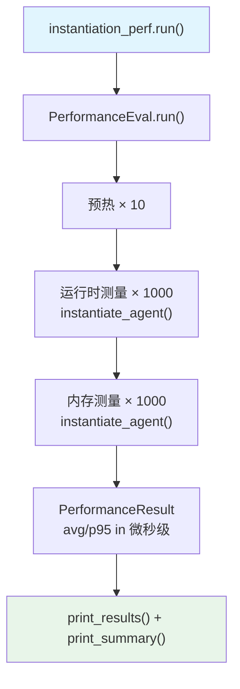

# instantiate_agent.py — 实现原理分析

> 源文件：`cookbook/09_evals/performance/instantiate_agent.py`

## 概述

本示例展示用 **`PerformanceEval`** 专项测试 **Agent 实例化性能**：将 `Agent(system_message=...)` 的构造开销在 1000 次迭代中精确测量，不涉及模型调用。

**核心配置一览：**

| 配置项 | 值 | 说明 |
|--------|------|------|
| `name` | `"Instantiation Performance"` | 评估名称 |
| `func` | `instantiate_agent` | 被测函数（仅构造 Agent） |
| `num_iterations` | `1000` | 高频迭代测量 |
| `warmup_runs` | `10`（默认） | 预热 10 次 |
| `model` | 无（Agent 未设置模型） | 不发起模型调用 |

## 核心组件解析

### 被测函数（无模型调用）

```python
def instantiate_agent():
    return Agent(system_message="Be concise, reply with one sentence.")
    # 只测 Agent.__init__() 开销，无 model 调用
```

### 实例化 vs 响应 性能对比

| 场景 | func 内容 | 迭代次数 | warmup |
|------|----------|---------|--------|
| 本文件（实例化） | `Agent(...)` 构造 | 1000 | 10 |
| `simple_response.py`（响应） | `agent.run(...)` | 1 | 0 |

实例化测试适用于：
- 评估框架冷启动成本
- 跨框架实例化性能对比（见 `comparison/` 目录）

## Mermaid 流程图



## 关键源码文件索引

| 文件 | 关键函数/类 | 作用 |
|------|------------|------|
| `agno/eval/performance.py` | `PerformanceEval.run()` L481 | 主测量流程 |
| `agno/agent/agent.py` | `Agent.__init__()` | 被测的 Agent 构造函数 |
