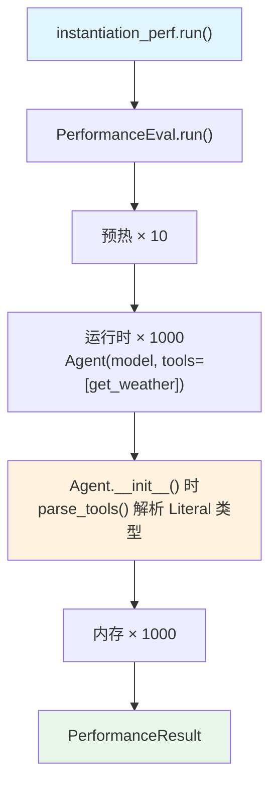

# instantiate_agent_with_tool.py — 实现原理分析

> 源文件：`cookbook/09_evals/performance/instantiate_agent_with_tool.py`

## 概述

本示例展示 **`PerformanceEval`** 对**带工具的 Agent 实例化性能**的测量：每次迭代构造一个含 `Literal` 类型函数工具的 Agent，测量 `_tools.parse_tools()` 等工具解析的额外开销。

**核心配置一览：**

| 配置项 | 值 | 说明 |
|--------|------|------|
| `name` | `"Agent Instantiation"` | 评估名称 |
| `func` | `instantiate_agent` | 被测函数 |
| `num_iterations` | `1000` | 高频迭代 |
| `warmup_runs` | `10`（默认） | 预热 10 次 |

## 核心组件解析

### 工具列表预创建（不在 func 内）

```python
# tools 在模块级别预创建，不在 instantiate_agent() 内创建
tools = [get_weather]  # 避免重复创建工具列表的开销

def instantiate_agent():
    return Agent(model=OpenAIChat(id="gpt-4o"), tools=tools)  # 复用同一 tools 列表
```

### Literal 类型工具的 JSON Schema 处理

`get_weather(city: Literal["nyc", "sf"])` 的 `Literal` 参数在工具解析时（`_tools.parse_tools()`）会触发 `utils/json_schema.py:124` 的 `get_json_schema_for_arg()`，生成 `{"type": "string", "enum": ["nyc", "sf"]}` Schema。

这是实例化开销比 `instantiate_agent.py`（无工具）略高的原因。

## Mermaid 流程图



## 关键源码文件索引

| 文件 | 关键函数/类 | 作用 |
|------|------------|------|
| `agno/eval/performance.py` | `PerformanceEval.run()` L481 | 主测量流程 |
| `agno/utils/json_schema.py` | `get_json_schema_for_arg()` L124 | Literal 类型 → JSON Schema |
