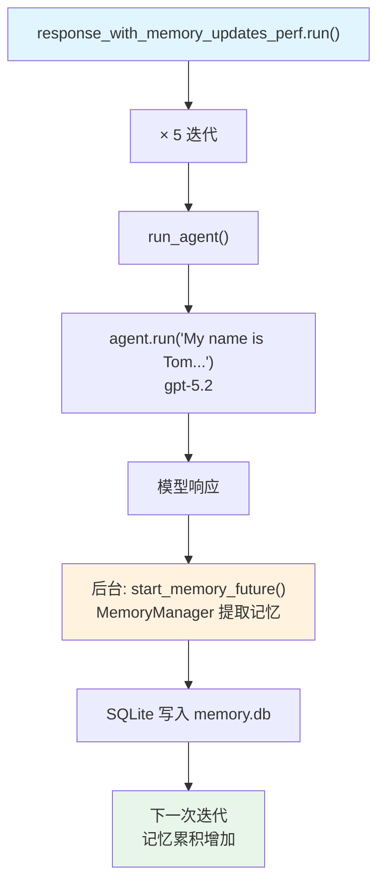

# response_with_memory_updates.py — 实现原理分析

> 源文件：`cookbook/09_evals/performance/response_with_memory_updates.py`

## 概述

本示例展示 **`PerformanceEval`** 对**开启 `update_memory_on_run` 的 Agent** 进行 5 次迭代性能测量：每次 `agent.run()` 后自动在后台触发记忆提取（memory extraction），测量其对响应延迟和内存的影响。

**核心配置一览：**

| 配置项 | 值 | 说明 |
|--------|------|------|
| `name` | `"Memory Updates Performance"` | 评估名称 |
| `func` | `run_agent` | 被测函数 |
| `num_iterations` | `5` | 5 次迭代 |
| `warmup_runs` | `0` | 无预热 |
| `db` | `SqliteDb(db_file="tmp/memory.db")` | 记忆持久化 DB |

## 核心组件解析

### update_memory_on_run 机制

```python
agent = Agent(
    model=OpenAIChat(id="gpt-5.2"),
    db=db,
    update_memory_on_run=True,  # 每次 run 后触发后台记忆提取
)
```

`update_memory_on_run=True` 时，`_run.py` 在 `cleanup_and_store()` 后调用 `_managers.start_memory_future()`（`_managers.py:177`），在后台线程中使用 `MemoryManager` 提取用户记忆。

### 记忆提取对性能的影响

| 指标 | 说明 |
|------|------|
| 主线程延迟 | 后台任务异步执行，不阻塞主 `agent.run()` 返回 |
| 内存增长 | tracemalloc 可能捕获后台线程的内存分配 |
| 5 次迭代 | 随迭代增加，记忆数量增长，每次提取的上下文也变长 |

## Mermaid 流程图



## 关键源码文件索引

| 文件 | 关键函数/类 | 作用 |
|------|------------|------|
| `agno/eval/performance.py` | `PerformanceEval.run()` L481 | 主测量流程 |
| `agno/agent/_managers.py` | `start_memory_future()` L177 | 后台记忆提取触发 |
| `agno/memory/manager.py` | `MemoryManager` L44 | 记忆提取管理器 |
