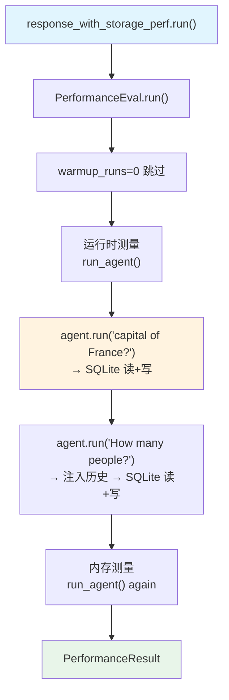

# response_with_storage.py — 实现原理分析

> 源文件：`cookbook/09_evals/performance/response_with_storage.py`

## 概述

本示例展示 **`PerformanceEval`** 对**带 SQLite 存储的多轮对话**性能测量：测量 Agent 在开启 `add_history_to_context=True` + SQLite 持久化时，完成两轮连续对话的综合延迟和内存开销。

**核心配置一览：**

| 配置项 | 值 | 说明 |
|--------|------|------|
| `name` | `"Storage Performance"` | 评估名称 |
| `func` | `run_agent` | 被测函数（含 2 次 agent.run） |
| `num_iterations` | `1` | 单次测量 |
| `warmup_runs` | `0` | 无预热 |
| `db` | `SqliteDb(db_file="tmp/storage.db")` | SQLite 会话存储 |

## 核心组件解析

### 被测函数：两轮对话 + SQLite

```python
def run_agent():
    agent = Agent(
        model=OpenAIChat(id="gpt-5.2"),
        system_message="Be concise, reply with one sentence.",
        db=db,                        # SQLite 会话存储
        add_history_to_context=True,  # 历史注入 system prompt
    )
    response_1 = agent.run("What is the capital of France?")  # 第 1 轮
    response_2 = agent.run("How many people live there?")     # 第 2 轮（依赖历史）
    return response_2.content
```

### 存储对性能的影响

每次 `agent.run()` 会触发：
1. `read_or_create_session()` → 从 SQLite 读取历史
2. 注入历史消息到 messages
3. 模型调用
4. `cleanup_and_store()` → 将新消息写入 SQLite

与 `simple_response.py`（无存储）对比，额外开销来自 SQLite I/O。

## Mermaid 流程图



## 关键源码文件索引

| 文件 | 关键函数/类 | 作用 |
|------|------------|------|
| `agno/eval/performance.py` | `PerformanceEval.run()` L481 | 主测量流程 |
| `agno/db/sqlite/` | `SqliteDb` | SQLite 会话存储 |
| `agno/agent/_messages.py` | `get_run_messages()` L1231-1262 | 历史消息注入 |
