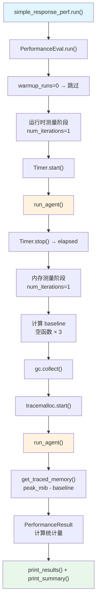

# simple_response.py — 实现原理分析

> 源文件：`cookbook/09_evals/performance/simple_response.py`

## 概述

本示例展示 Agno **`PerformanceEval`** 的基础用法：对一个同步 Agent 响应函数进行运行时（runtime）和内存（memory）基准测试，统计 avg/min/max/std_dev/median/p95 等性能指标。

**核心配置一览：**

| 配置项 | 值 | 说明 |
|--------|------|------|
| `name` | `"Simple Performance Evaluation"` | 评估名称 |
| `func` | `run_agent` | 被测函数 |
| `num_iterations` | `1` | 测量迭代次数 |
| `warmup_runs` | `0` | 无预热 |
| `measure_runtime` | `True`（默认） | 开启运行时测量 |
| `measure_memory` | `True`（默认） | 开启内存测量 |
| `db` | `None` | 不持久化 |

## 架构分层

```
用户代码层                      agno.eval 层
┌──────────────────────┐    ┌──────────────────────────────────────────────┐
│ simple_response.py   │    │ PerformanceEval.run()                        │
│                      │    │  ├─ 1. warmup_runs=0（跳过预热）              │
│ simple_response_perf │───>│  ├─ 2. 运行时测量（num_iterations=1）         │
│   .run()             │    │  │    Timer.start() → func() → Timer.stop()  │
│                      │    │  ├─ 3. 内存测量（num_iterations=1）           │
│                      │    │  │    gc.collect() → tracemalloc.start()     │
│                      │    │  │    → func() → get_traced_memory() → stop  │
│                      │    │  └─ 4. PerformanceResult 统计                 │
└──────────────────────┘    └──────────────────────────────────────────────┘
                                            │
                                            ▼
                                    ┌──────────────┐
                                    │ OpenAIChat   │
                                    │ gpt-5.2      │
                                    └──────────────┘
```

## 核心组件解析

### PerformanceEval 测量机制

`PerformanceEval.run()` 执行两阶段测量（`performance.py:481`）：

**运行时测量（`_measure_time()`，`performance.py:232`）：**
```python
def _measure_time(self) -> float:
    timer = Timer()
    timer.start()
    self.func()          # 调用被测函数
    timer.stop()
    return timer.elapsed  # 秒
```

**内存测量（`_measure_memory()`，`performance.py:254`）：**
```python
def _measure_memory(self, baseline: float) -> float:
    gc.collect()              # 强制 GC，减少噪声
    tracemalloc.start()       # 开始追踪内存分配
    self.func()               # 调用被测函数
    current, peak = tracemalloc.get_traced_memory()
    tracemalloc.stop()
    peak_mib = peak / 1024 / 1024
    return max(0, peak_mib - baseline)  # 减去基线
```

### 内存基线计算

`_compute_tracemalloc_baseline(samples=3)` 运行空函数 3 次取均值，用于消除 tracemalloc 自身开销（`performance.py:339`）。

### PerformanceResult 统计

```python
PerformanceResult:
    # 运行时（秒）
    avg_run_time, min_run_time, max_run_time
    std_dev_run_time, median_run_time, p95_run_time
    # 内存（MiB）
    avg_memory_usage, min_memory_usage, max_memory_usage
    std_dev_memory_usage, median_memory_usage, p95_memory_usage
```

### 被测函数结构

```python
def run_agent():
    # PerformanceEval 会在每次迭代中调用此函数
    agent = Agent(
        model=OpenAIChat(id="gpt-5.2"),
        system_message="Be concise, reply with one sentence.",
    )
    response = agent.run("What is the capital of France?")
    return response
```

> 注意：`run_agent()` 每次都创建新 Agent 实例，性能测试中包含 Agent 实例化开销。

## Mermaid 流程图



## 关键源码文件索引

| 文件 | 关键函数/类 | 作用 |
|------|------------|------|
| `agno/eval/performance.py` | `PerformanceEval` L179 | 性能评估 dataclass |
| `agno/eval/performance.py` | `run()` L481 | 同步测量主流程 |
| `agno/eval/performance.py` | `_measure_time()` L232 | 运行时测量 |
| `agno/eval/performance.py` | `_measure_memory()` L254 | 内存测量 |
| `agno/eval/performance.py` | `_compute_tracemalloc_baseline()` L339 | 基线计算 |
| `agno/eval/performance.py` | `PerformanceResult` L19 | 统计结果容器 |
| `agno/utils/timer.py` | `Timer` | 高精度计时器 |
