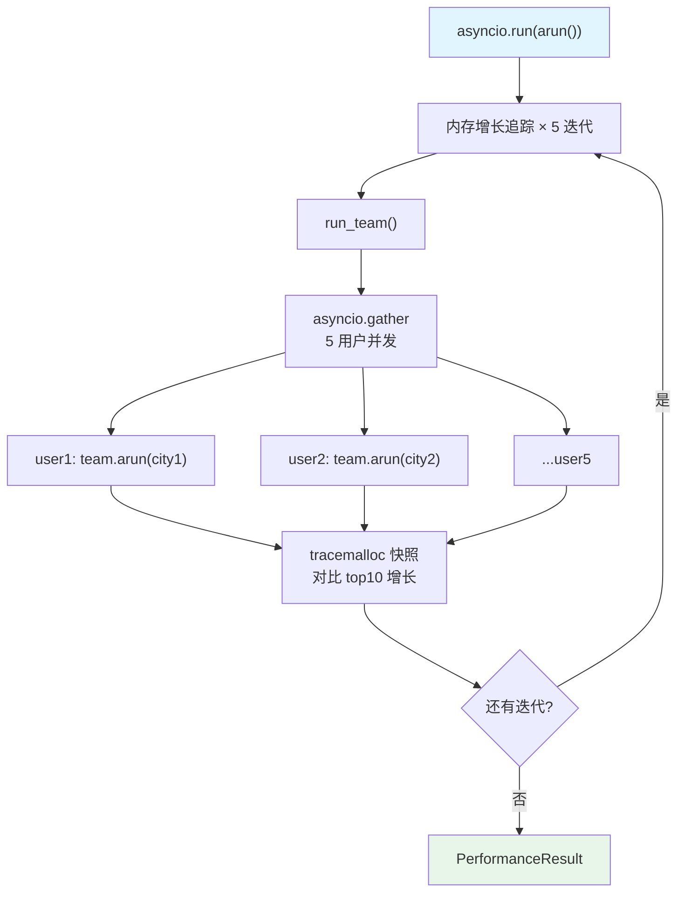

# team_response_with_memory_multi_user.py — 实现原理分析

> 源文件：`cookbook/09_evals/performance/team_response_with_memory_multi_user.py`

## 概述

本示例展示 **`PerformanceEval`** 对**多用户并发 Team** 场景的内存增长测量：5 个用户并发（`asyncio.gather`）请求 2 成员团队（weather + activities），每次迭代分别使用独立的 `user_id` 和 `session_id`，开启 `top_n_memory_allocations=10` 追踪最多内存分配来源。

**核心配置一览：**

| 配置项 | 值 | 说明 |
|--------|------|------|
| `name` | `"Team Memory Impact"` | 评估名称 |
| `func` | `run_team`（async） | 被测函数（5 用户并发） |
| `num_iterations` | `5` | 5 次迭代 |
| `warmup_runs` | `0` | 无预热 |
| `measure_runtime` | `False` | 只测内存 |
| `memory_growth_tracking` | `True` | 开启增长追踪 |
| `top_n_memory_allocations` | `10` | 追踪 Top10 内存分配 |

## 核心组件解析

### 多用户并发执行

```python
async def run_team():
    async def run_team_for_user(user: str):
        random_city = random.choice(cities)
        await team.arun(
            input=f"...",
            user_id=user,                      # 用户隔离
            session_id=f"session_{uuid.uuid4()}",  # 每次新会话
        )

    tasks = [run_team_for_user(user) for user in users]  # 5 个用户
    await asyncio.gather(*tasks)  # 并发执行
```

### top_n_memory_allocations=10

```python
# _compare_memory_snapshots() 中
for stat in stats[:self.top_n_memory_allocations]:  # top 10
    if stat.size_diff > 0:
        log_debug(f"  +{stat.size_diff / 1024 / 1024:.1f} MiB...")
```

### 2 成员 Team（weather + activities）

```python
team = Team(
    members=[weather_agent, activities_agent],  # 2 个专业成员
    model=OpenAIChat(id="gpt-5.2"),
    db=db,  # PostgreSQL（5 用户共享同一 DB）
    update_memory_on_run=True,
    add_history_to_context=True,
)
```

## Mermaid 流程图



## 关键源码文件索引

| 文件 | 关键函数/类 | 作用 |
|------|------------|------|
| `agno/eval/performance.py` | `top_n_memory_allocations` L212 | 控制追踪数量 |
| `agno/eval/performance.py` | `_compare_memory_snapshots()` L365 | 快照差异对比 |
