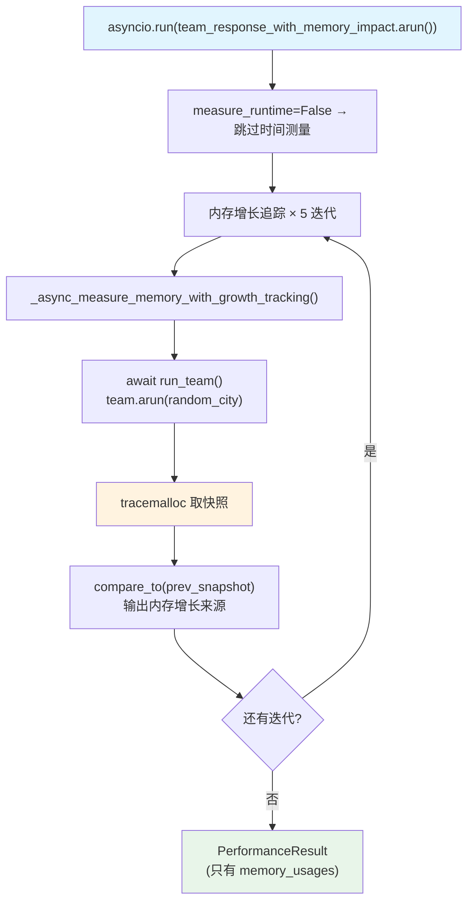

# team_response_with_memory_simple.py — 实现原理分析

> 源文件：`cookbook/09_evals/performance/team_response_with_memory_simple.py`

## 概述

本示例展示 **`PerformanceEval`** 对**带内存增长追踪的异步 Team 响应**进行 5 次迭代测量：开启 `memory_growth_tracking=True` + `debug_mode=True` 以记录每次迭代间的内存增长来源，测量带 `update_memory_on_run` + `add_history_to_context` + `stream_events` 的 Team 完整运行开销。

**核心配置一览：**

| 配置项 | 值 | 说明 |
|--------|------|------|
| `name` | `"Team Memory Impact"` | 评估名称 |
| `func` | `run_team`（async） | 被测异步函数 |
| `num_iterations` | `5` | 5 次迭代 |
| `warmup_runs` | `0` | 无预热 |
| `measure_runtime` | `False` | 不测时间 |
| `memory_growth_tracking` | `True` | 开启内存增长追踪 |
| `debug_mode` | `True` | 输出详细调试信息 |

## 核心组件解析

### memory_growth_tracking 机制

开启后，使用 `_async_measure_memory_with_growth_tracking()`（`performance.py:437`）：

```python
async def _async_measure_memory_with_growth_tracking(
    self, baseline: float, previous_snapshot=None
) -> tuple[float, tracemalloc.Snapshot]:
    gc.collect()
    tracemalloc.start()
    await self.func()
    current, peak = tracemalloc.get_traced_memory()
    current_snapshot = tracemalloc.take_snapshot()  # ← 额外取快照
    tracemalloc.stop()
    # 与上次快照对比，输出增长来源
    if previous_snapshot is not None:
        self._compare_memory_snapshots(previous_snapshot, current_snapshot, self.top_n_memory_allocations)
    return adjusted_usage, current_snapshot
```

### _compare_memory_snapshots()

比较两次快照差异（`performance.py:365`），以 `lineno` 粒度展示哪些代码行导致了内存增长：

```python
stats = snapshot2.compare_to(snapshot1, "lineno")
for stat in stats[:top_n]:
    if stat.size_diff > 0:  # 只显示增长
        log_debug(f"  +{stat.size_diff / 1024 / 1024:.1f} MiB: {stat.count_diff} new blocks")
```

### 被测 Team（PostgreSQL + stream_events）

```python
weather_agent = Agent(
    model=OpenAIChat(id="gpt-5.2"),
    tools=[get_weather],
    db=db,                        # PostgreSQL
    update_memory_on_run=True,
    add_history_to_context=True,
    stream_events=True,           # 流式事件模式
)
team = Team(
    members=[weather_agent],
    model=OpenAIChat(id="gpt-5.2"),
    db=db,
    update_memory_on_run=True,
    add_history_to_context=True,
)
```

## Mermaid 流程图



## 关键源码文件索引

| 文件 | 关键函数/类 | 作用 |
|------|------------|------|
| `agno/eval/performance.py` | `_async_measure_memory_with_growth_tracking()` L437 | 带快照对比的内存测量 |
| `agno/eval/performance.py` | `_compare_memory_snapshots()` L365 | 快照差异分析 |
| `agno/eval/performance.py` | `arun()` L624 | 异步测量主流程 |
