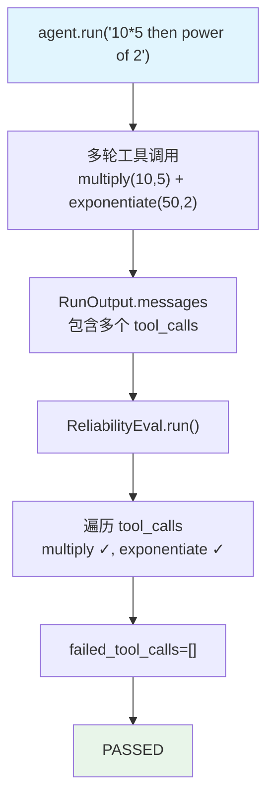

# calculator.py (multiple_tool_calls) — 实现原理分析

> 源文件：`cookbook/09_evals/reliability/multiple_tool_calls/calculator.py`

## 概述

本示例展示 **`ReliabilityEval`** 对**多工具调用**的验证：期望 Agent 在回答多步计算时依次调用 `multiply` 和 `exponentiate` 两个工具，验证两者均被触发。

**核心配置一览：**

| 配置项 | 值 | 说明 |
|--------|------|------|
| `name` | `"Tool Calls Reliability"` | 评估名称 |
| `agent_response` | `agent.run("What is 10*5 then to the power of 2? ...")` | 被评估响应 |
| `expected_tool_calls` | `["multiply", "exponentiate"]` | 期望的两个工具 |

## 核心组件解析

### 多工具验证逻辑

`expected_tool_calls=["multiply", "exponentiate"]` 时，验证逻辑检查实际调用的工具中**每个**是否在期望列表内：

```python
# reliability.py:119-127
for tool_call in actual_tool_calls:
    tool_name = tool_call.get("function", {}).get("name")
    if tool_name not in self.expected_tool_calls:
        failed_tool_calls.append(tool_name)   # 调用了期望外的工具
    else:
        passed_tool_calls.append(tool_name)   # 调用了期望内的工具
```

> 注意：`ReliabilityEval` 验证的是"实际调用的工具是否都在期望列表内"，而非"期望列表中的工具是否都被调用"。若 Agent 只调用了 `multiply` 而未调用 `exponentiate`，`eval_status` 仍为 `PASSED`（passed_tool_calls=["multiply"]，failed_tool_calls=[]）。

### Agent 多步工具调用流程

```
用户输入: "What is 10*5 then to the power of 2? do it step by step"
↓
第 1 轮: tool_call → multiply(10, 5) → 50
↓
第 2 轮: tool_call → exponentiate(50, 2) → 2500
↓
最终回答: 2500
```

## Mermaid 流程图



## 关键源码文件索引

| 文件 | 关键函数/类 | 作用 |
|------|------------|------|
| `agno/eval/reliability.py` | `run()` L119-127 | 工具名对比逻辑 |
| `agno/tools/calculator.py` | `multiply()`, `exponentiate()` | 被调用的计算工具 |
