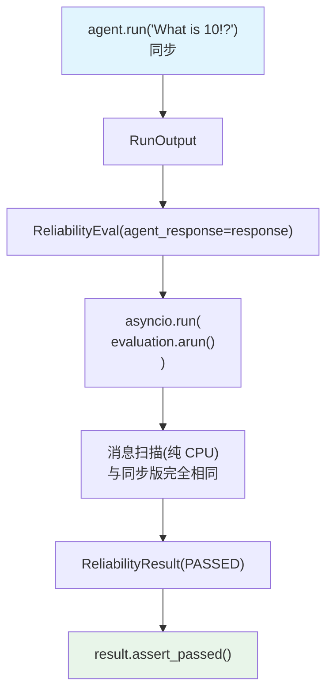

# reliability_async.py — 实现原理分析

> 源文件：`cookbook/09_evals/reliability/reliability_async.py`

## 概述

本示例展示 **`ReliabilityEval.arun()`** 的异步执行：先用同步 `agent.run()` 获取响应，再用 `asyncio.run(evaluation.arun(...))` 异步方式执行可靠性验证。

**核心配置一览：**

| 配置项 | 值 | 说明 |
|--------|------|------|
| `agent_response` | `agent.run("What is 10!?")` 的 RunOutput | 被评估响应（同步获取） |
| `expected_tool_calls` | `["factorial"]` | 期望工具 |

## 核心组件解析

### arun() vs run() 的区别

`ReliabilityEval.arun()`（`reliability.py:192`）与同步 `run()` 逻辑**完全相同**（消息扫描是纯 CPU 操作，无 I/O），只是方法签名为 `async`。差异仅在 DB 写入时使用 `await async_log_eval()`：

```python
async def arun(self, *, print_results: bool = False) -> Optional[ReliabilityResult]:
    # 相同的消息扫描逻辑...
    # DB 写入使用异步版本
    await async_log_eval(db=self.db, ...)
```

### 混合同步/异步调用模式

```python
# 同步获取 Agent 响应
response: RunOutput = agent.run("What is 10!?")

# 异步运行可靠性评估
result = asyncio.run(
    evaluation.arun(print_results=True)  # ← 异步
)
```

这种模式适用于：Agent 本身用同步方式运行，但评估框架需要在异步上下文中执行（如与其他异步操作组合）。

## Mermaid 流程图



## 关键源码文件索引

| 文件 | 关键函数/类 | 作用 |
|------|------------|------|
| `agno/eval/reliability.py` | `arun()` L192 | 异步评估入口 |
| `agno/eval/utils.py` | `async_log_eval()` | 异步 DB 日志写入 |
