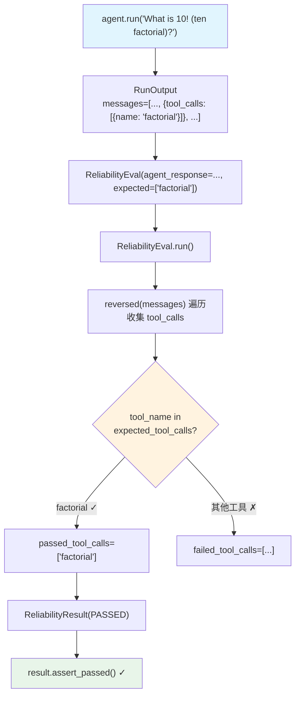

# calculator.py (single_tool_calls) — 实现原理分析

> 源文件：`cookbook/09_evals/reliability/single_tool_calls/calculator.py`

## 概述

本示例展示 Agno **`ReliabilityEval`** 的基础用法：验证 Agent 在回答 `10!` 时是否调用了 `factorial` 工具，通过检查 `agent_response.messages` 中的 `tool_calls` 字段实现确定性工具调用可靠性验证。

**核心配置一览：**

| 配置项 | 值 | 说明 |
|--------|------|------|
| `name` | `"Tool Call Reliability"` | 评估名称 |
| `agent_response` | `agent.run("What is 10! (ten factorial)?")` 的返回值 | 被评估的 RunOutput |
| `expected_tool_calls` | `["factorial"]` | 期望调用的工具名列表 |
| `db` | `None` | 不持久化 |

## 架构分层

```
用户代码层                      agno.eval 层
┌──────────────────────┐    ┌────────────────────────────────────────┐
│ calculator.py        │    │ ReliabilityEval.run()                  │
│                      │    │  ├─ 从 agent_response.messages 提取    │
│ response = agent.run │───>│  │    reversed(messages) 中的 tool_calls│
│ evaluation =         │    │  ├─ 对比 tool_name in expected_tool_calls│
│   ReliabilityEval(   │    │  └─ ReliabilityResult(PASSED/FAILED)   │
│     agent_response   │    │                                        │
│     expected_tool    │    │                                        │
│     _calls=          │    │                                        │
│     ["factorial"]    │    │                                        │
│   )                  │    │                                        │
└──────────────────────┘    └────────────────────────────────────────┘
```

## 核心组件解析

### ReliabilityEval 工具调用验证逻辑

`ReliabilityEval.run()` 不调用任何 LLM，只做确定性的消息扫描（`reliability.py:98-133`）：

```python
# 1. 从消息列表反向遍历，收集所有 tool_calls
for message in reversed(messages):
    if message.tool_calls:
        if actual_tool_calls is None:
            actual_tool_calls = message.tool_calls
        else:
            actual_tool_calls.append(message.tool_calls[0])

# 2. 对比期望工具调用
for tool_call in actual_tool_calls:
    tool_name = tool_call.get("function", {}).get("name")
    if tool_name not in self.expected_tool_calls:
        failed_tool_calls.append(tool_name)   # 未期望的工具
    else:
        passed_tool_calls.append(tool_name)   # 期望的工具

# 3. 判断通过/失败
self.result = ReliabilityResult(
    eval_status="PASSED" if len(failed_tool_calls) == 0 else "FAILED",
    failed_tool_calls=failed_tool_calls,
    passed_tool_calls=passed_tool_calls,
)
```

### ReliabilityResult 结构

```python
@dataclass
class ReliabilityResult:
    eval_status: str           # "PASSED" 或 "FAILED"
    failed_tool_calls: List[str]  # 未期望的工具名
    passed_tool_calls: List[str]  # 期望的工具名

    def assert_passed(self):
        assert self.eval_status == "PASSED"  # 失败时抛出 AssertionError
```

### agent vs team 路径

```python
# agent_response 路径
if self.agent_response is not None:
    messages = self.agent_response.messages  # RunOutput.messages

# team_response 路径（本文件不用）
elif self.team_response is not None:
    messages = self.team_response.messages or []
    for member_response in self.team_response.member_responses:
        messages += member_response.messages  # 合并所有成员消息
```

## Mermaid 流程图



## 关键源码文件索引

| 文件 | 关键函数/类 | 作用 |
|------|------------|------|
| `agno/eval/reliability.py` | `ReliabilityEval` L41 | 工具调用可靠性评估 |
| `agno/eval/reliability.py` | `run()` L73 | 同步评估主流程 |
| `agno/eval/reliability.py` | `ReliabilityResult` L18 | 评估结果容器 |
| `agno/run/agent.py` | `RunOutput.messages` | Agent 运行后的消息列表 |
