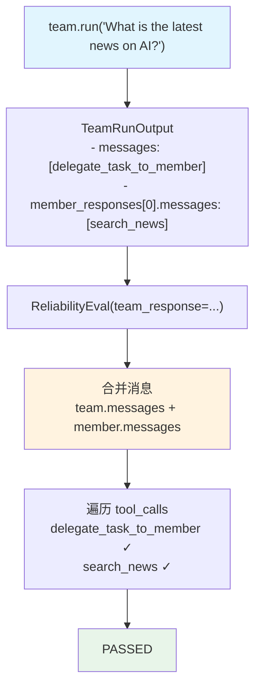

# ai_news.py (reliability/team) — 实现原理分析

> 源文件：`cookbook/09_evals/reliability/team/ai_news.py`

## 概述

本示例展示 **`ReliabilityEval`** 对 **Team（团队）响应**的可靠性验证：检查 Team 在完成 AI 新闻搜索任务时，是否调用了 `delegate_task_to_member`（Team 委派工具）和 `search_news`（成员搜索工具）两个关键工具。

**核心配置一览：**

| 配置项 | 值 | 说明 |
|--------|------|------|
| `name` | `"Team Reliability Evaluation"` | 评估名称 |
| `team_response` | `team.run("What is the latest news on AI?")` | 被评估的 TeamRunOutput |
| `expected_tool_calls` | `["delegate_task_to_member", "search_news"]` | 期望工具 |
| **Team** | | |
| `model` | `OpenAIChat("gpt-4o")` | 协调模型 |
| `members` | `[team_member(News Searcher + WebSearchTools)]` | 单成员 |

## 核心组件解析

### Team vs Agent 响应提取差异

Team 评估时，消息来源从两处合并（`reliability.py:101-105`）：

```python
elif self.team_response is not None:
    messages = self.team_response.messages or []          # Team 协调层消息
    for member_response in self.team_response.member_responses:
        if member_response.messages is not None:
            messages += member_response.messages          # 每个成员的消息
```

因此 `expected_tool_calls` 可以跨层验证：
- `delegate_task_to_member`：来自 Team 协调层消息
- `search_news`：来自成员 Agent 消息

### Team 协调工具（内置）

Team 在委派任务给成员时会调用内置工具 `delegate_task_to_member`，这是 Team 模式的标准行为。

```python
expected_tool_calls = [
    "delegate_task_to_member",  # Team 协调层调用
    "search_news",              # 成员 Agent 调用（WebSearchTools.search_news）
]
```

### TeamRunOutput 结构

```python
# run/team.py
TeamRunOutput:
    messages: List[Message]              # Team 协调层消息
    member_responses: List[RunOutput]    # 各成员的 RunOutput
    team_id: str
    model: str
    model_provider: str
```

## Mermaid 流程图



## 关键源码文件索引

| 文件 | 关键函数/类 | 作用 |
|------|------------|------|
| `agno/eval/reliability.py` | `run()` L101-105 | Team 消息合并逻辑 |
| `agno/run/team.py` | `TeamRunOutput` | Team 响应容器 |
| `agno/tools/websearch.py` | `WebSearchTools.search_news` | 新闻搜索工具 |
