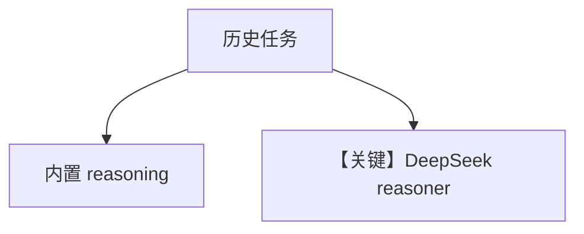

# analyse_treaty_of_versailles.py — 实现原理分析

> 源文件：`cookbook/10_reasoning/agents/analyse_treaty_of_versailles.py`

## 概述

本示例对比 **`reasoning=True`** 与 **`reasoning_model=DeepSeek("deepseek-reasoner")`** 的长篇历史分析任务；主模型均为 `OpenAIChat(gpt-4o)`。

**核心配置一览：**

| 配置项 | 值 | 说明 |
|--------|------|------|
| `task` | 凡尔赛条约多视角分析 | 长提示 |
| `deepseek_agent` | DeepSeek 作推理后端 | 外接 reasoner |

## 完整 API 请求

主对话走 Chat Completions；DeepSeek 路径见 `agno/models/deepseek`。

## Mermaid 流程图

## 关键源码文件索引

| 文件 | 作用 |
|------|------|
| `agno/models/deepseek` | DeepSeek |
