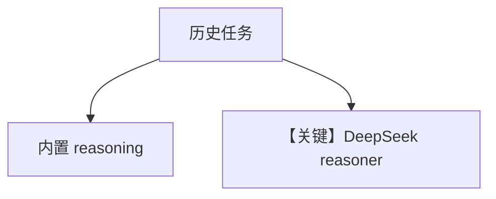

# analyse_treaty_of_versailles.py — 实现原理分析

<!-- cookbook-py-source:start -->
## 完整源码

```python
"""
Treaty Of Versailles Analysis
============================

Demonstrates built-in and DeepSeek-backed reasoning for historical analysis.
"""

from agno.agent import Agent
from agno.models.deepseek import DeepSeek
from agno.models.openai import OpenAIChat

# ---------------------------------------------------------------------------
# Create Agents
# ---------------------------------------------------------------------------
task = (
    "Analyze the key factors that led to the signing of the Treaty of Versailles in 1919. "
    "Discuss the political, economic, and social impacts of the treaty on Germany and how it "
    "contributed to the onset of World War II. Provide a nuanced assessment that includes "
    "multiple historical perspectives."
)

cot_agent = Agent(
    model=OpenAIChat(id="gpt-4o"),
    reasoning=True,
    markdown=True,
)

deepseek_agent = Agent(
    model=OpenAIChat(id="gpt-4o"),
    reasoning_model=DeepSeek(id="deepseek-reasoner"),
    markdown=True,
)

# ---------------------------------------------------------------------------
# Run Agents
# ---------------------------------------------------------------------------
if __name__ == "__main__":
    print("=== Built-in Chain Of Thought ===")
    cot_agent.print_response(task, stream=True, show_full_reasoning=True)

    print("\n=== DeepSeek Reasoning Model ===")
    deepseek_agent.print_response(task, stream=True, show_full_reasoning=True)
```

<!-- cookbook-py-source:end -->

> 源文件：`cookbook/10_reasoning/agents/analyse_treaty_of_versailles.py`

## 概述

本示例对比 **`reasoning=True`** 与 **`reasoning_model=DeepSeek("deepseek-reasoner")`** 的长篇历史分析任务；主模型均为 `OpenAIChat(gpt-4o)`。

**核心配置一览：**

| 配置项 | 值 | 说明 |
|--------|------|------|
| `task` | 凡尔赛条约多视角分析 | 长提示 |
| `deepseek_agent` | DeepSeek 作推理后端 | 外接 reasoner |

## 完整 API 请求

主对话走 Chat Completions；DeepSeek 路径见 `agno/models/deepseek`。

## Mermaid 流程图



## 关键源码文件索引

| 文件 | 作用 |
|------|------|
| `agno/models/deepseek` | DeepSeek |
