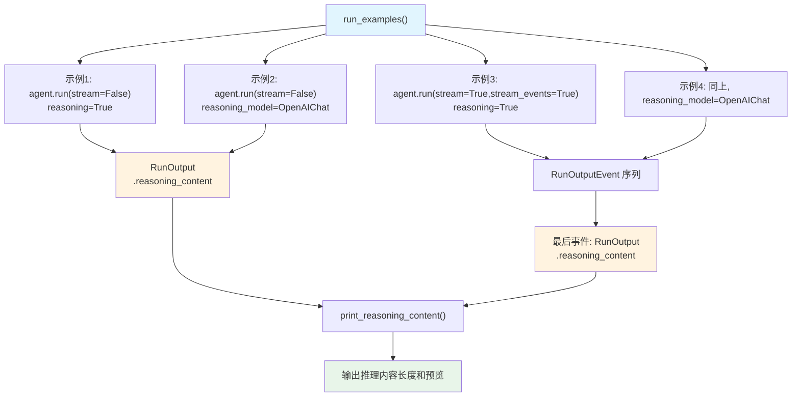

# capture_reasoning_content_default_COT.py — 实现原理分析

> 源文件：`cookbook/10_reasoning/agents/capture_reasoning_content_default_COT.py`

## 概述

本示例展示如何**以编程方式捕获和访问 `reasoning_content`**，演示了在非流式（`stream=False`）和流式（`stream=True, stream_events=True`）两种模式下如何从 `RunOutput` 对象中获取推理内容。这是调试推理过程、分析推理质量的关键模式。

**核心配置一览：**

| 配置项 | agent（示例1&2） | streaming_agent（示例3） | streaming_agent_with_model（示例4） |
|--------|----------------|------------------------|-------------------------------------|
| `model` | `OpenAIChat(id="gpt-4o")` | `OpenAIChat(id="gpt-4o")` | `OpenAIChat(id="gpt-4o")` |
| `reasoning` | `True` | `True` | `False`（默认） |
| `reasoning_model` | `None`（示例1）/ `OpenAIChat(id="gpt-4o")`（示例2） | `None` | `OpenAIChat(id="gpt-4o")` |
| `markdown` | `True` | `True` | `True` |

## 架构分层

```
用户代码层                          agno.agent 层
┌──────────────────────────┐    ┌──────────────────────────────────┐
│ capture_reasoning_content│    │ Agent.run()                      │
│ _default_COT.py          │    │  └ returns RunOutput             │
│                          │    │      ├ .content                  │
│ response = agent.run(...)│───>│      ├ .reasoning_content        │
│ response.reasoning_content    │      └ ...                       │
│                          │    │                                  │
│ for event in agent.run(  │    │ Agent.run(stream_events=True)    │
│   stream_events=True):   │───>│  └ yields RunOutputEvent         │
│   event.reasoning_content│    │      └ final: RunOutput w/ RC   │
└──────────────────────────┘    └──────────────────────────────────┘
```

## 核心组件解析

### reasoning_content 的存储位置

`reasoning_content` 是 `RunOutput` 对象的属性，由 `_response.py` 中的 `update_run_output_with_reasoning()` 函数写入：

```python
# _response.py（工具函数）
from agno.utils.reasoning import update_run_output_with_reasoning
# 推理完成后，将所有 ReasoningStep 序列化为文字，写入 run_response.reasoning_content
```

非流式模式：`agent.run(stream=False)` 直接返回 `RunOutput`，可通过 `response.reasoning_content` 访问。

流式 + `stream_events=True` 模式：`agent.run(stream=True, stream_events=True)` 产出一系列 `RunOutputEvent`，**最后一个** 事件是包含 `reasoning_content` 的 `RunOutput`（`RunEvent.run_completed`）。

### 流式事件过滤技巧

```python
# 通过检查 hasattr 找到最后一个含 reasoning_content 的事件
for event in streaming_agent.run(..., stream_events=True):
    if hasattr(event, "reasoning_content"):
        final_response = event  # 持续更新，保留最后一个
```

这个模式利用了 `RunOutput` 是唯一有 `reasoning_content` 属性的事件类型这一特性。

## System Prompt 组装

| 序号 | 组成部分 | 本文件中的值/来源 | 是否生效 |
|------|---------|-----------------|---------|
| 3.2.1 | `markdown` | `True` | 是 |
| 其他 | 未设置 | — | 否 |

### 最终 System Prompt

```text
Use markdown to format your answers.
```

## Mermaid 流程图



## 关键源码文件索引

| 文件 | 关键函数/类 | 作用 |
|------|------------|------|
| `agno/agent/agent.py` | `reasoning` L184, `reasoning_model` L185 | 推理配置 |
| `agno/agent/_response.py` | `handle_reasoning()` L70 | 非流式推理触发 |
| `agno/run/agent.py` | `RunOutput` L581 | 含 reasoning_content 的输出容器 |
| `agno/run/agent.py` | `RunEvent` L134 | 事件类型枚举 |
| `agno/utils/reasoning.py` | `update_run_output_with_reasoning()` | 写入 reasoning_content |
