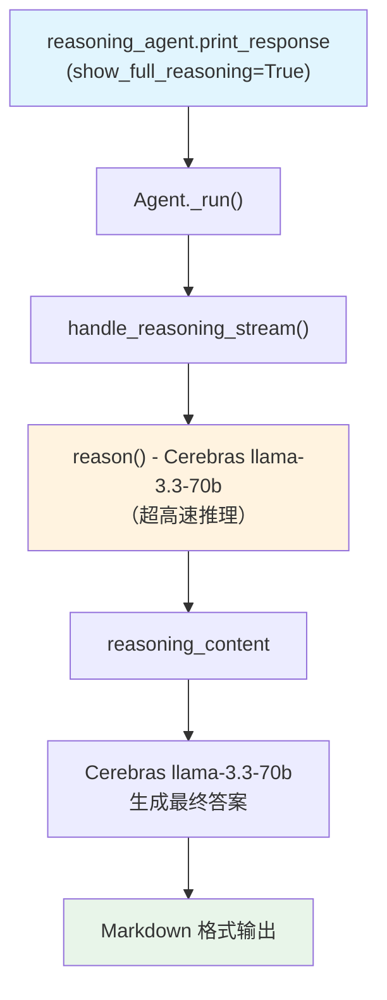

# cerebras_llama_default_COT.py — 实现原理分析

> 源文件：`cookbook/10_reasoning/agents/cerebras_llama_default_COT.py`

## 概述

本示例展示 Agno 的 **`reasoning=True`（内置链式思维）** 与 **Cerebras 模型**（`llama-3.3-70b`）的结合。Cerebras 是一家以极高推理速度著称的 AI 芯片公司，其 API 与 OpenAI 兼容。本示例演示如何在 Cerebras 托管的 Llama 3.3 上启用 Agno 的内置 COT 推理。

**核心配置一览：**

| 配置项 | 值 | 说明 |
|--------|------|------|
| `model` | `Cerebras(id="llama-3.3-70b")` | Cerebras 平台上的 Llama 3.3 |
| `reasoning` | `True` | 启用内置 COT 推理 |
| `debug_mode` | `True` | 输出详细调试日志 |
| `markdown` | `True` | Markdown 格式化 |

## 架构分层

```
用户代码层                     agno.agent 层
┌──────────────────────┐    ┌──────────────────────────────────┐
│ cerebras_llama_      │    │ Agent._run()                     │
│ default_COT.py       │    │  ├ handle_reasoning_stream()     │
│                      │    │  │    reason() →                 │
│ reasoning_agent:     │───>│  │    ReasoningManager.run()     │
│   Cerebras(llama-3.3)│    │  │    (Cerebras 高速推理)        │
│   reasoning=True     │    │  └ Cerebras 主模型 response      │
│   debug_mode=True    │    │                                  │
└──────────────────────┘    └──────────────────────────────────┘
                                        │
                                        ▼
                                ┌──────────────────┐
                                │ Cerebras         │
                                │ llama-3.3-70b    │
                                │ (超低延迟推理)   │
                                └──────────────────┘
```

## System Prompt 组装

| 序号 | 组成部分 | 本文件中的值/来源 | 是否生效 |
|------|---------|-----------------|---------|
| 3.2.1 | `markdown` | `True` | 是 |
| 其他 | 未设置 | — | 否 |

### 最终 System Prompt

```text
Use markdown to format your answers.
```

## Mermaid 流程图



## 关键源码文件索引

| 文件 | 关键函数/类 | 作用 |
|------|------------|------|
| `agno/agent/agent.py` | `reasoning` L184 | 内置 COT 开关 |
| `agno/agent/_response.py` | `handle_reasoning_stream()` L86 | 流式推理触发 |
| `agno/models/cerebras` | `Cerebras` | Cerebras 模型类 |
