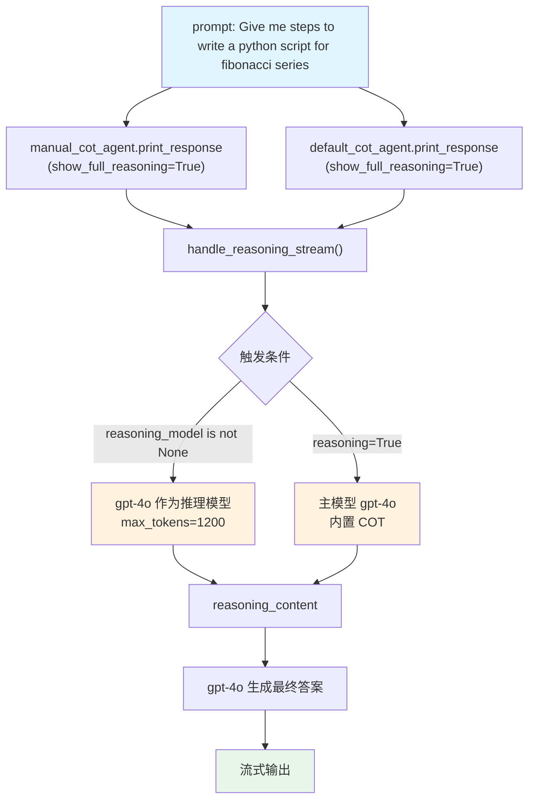

# default_chain_of_thought.py — 实现原理分析

> 源文件：`cookbook/10_reasoning/agents/default_chain_of_thought.py`

## 概述

本示例展示 Agno 的**两种链式思维变体**：`reasoning_model` 显式回退（`manual_cot_agent`）与 `reasoning=True` 内置 COT（`default_cot_agent`）。前者通过 `reasoning_model=OpenAIChat(id="gpt-4o", max_tokens=1200)` 显式指定同款模型作为推理步骤执行者；后者通过 `reasoning=True` 让 Agno 自动启用内置 COT 流程。

**核心配置一览：**

| 配置项 | manual_cot_agent | default_cot_agent | 说明 |
|--------|-----------------|-------------------|------|
| `model` | `OpenAIChat(id="gpt-4o")` | `OpenAIChat(id="gpt-4o", max_tokens=1200)` | Chat Completions API |
| `reasoning_model` | `OpenAIChat(id="gpt-4o", max_tokens=1200)` | `None` | 显式指定推理模型 |
| `reasoning` | `False`（默认） | `True` | 内置 COT 开关 |
| `markdown` | `True` | `True` | Markdown 格式化 |

## 架构分层

```
用户代码层                          agno.agent 层
┌──────────────────────────┐    ┌──────────────────────────────────┐
│ default_chain_of_thought │    │ Agent._run()                     │
│ .py                      │    │  ├ handle_reasoning_stream()     │
│                          │    │  │    reason()                   │
│ manual_cot_agent:        │    │  │    ├ reasoning_model 存在:    │
│   reasoning_model=       │───>│  │    │   用指定 gpt-4o 推理     │
│   OpenAIChat(gpt-4o,     │    │  │    └ reasoning=True:          │
│     max_tokens=1200)     │    │  │        用主模型自推理         │
│                          │    │  └ main model response           │
│ default_cot_agent:       │───>│                                  │
│   reasoning=True         │    │                                  │
└──────────────────────────┘    └──────────────────────────────────┘
```

## 核心组件解析

### reasoning_model vs reasoning=True 的区别

| 特性 | `reasoning_model` 显式指定 | `reasoning=True` 内置 |
|------|--------------------------|----------------------|
| 推理模型 | 用户指定的模型（可与主模型不同） | Agno 自动决定（通常用主模型） |
| max_tokens | 可单独配置（本例 1200） | 继承主模型设置 |
| 触发条件 | `agent.reasoning_model is not None` | `agent.reasoning is True` |
| 源码位置 | `_response.py:73` | `_response.py:73` |

两个条件都触发同一个 `handle_reasoning_stream()` 函数，内部通过 `reason()` 选择推理执行模型。

## System Prompt 组装

| 序号 | 组成部分 | 本文件中的值/来源 | 是否生效 |
|------|---------|-----------------|---------|
| 3.2.1 | `markdown` | `True` | 是 |
| 其他 | 未设置 | — | 否 |

### 最终 System Prompt

```text
Use markdown to format your answers.
```

## Mermaid 流程图



## 关键源码文件索引

| 文件 | 关键函数/类 | 作用 |
|------|------------|------|
| `agno/agent/agent.py` | `reasoning` L184 | 内置 COT 开关 |
| `agno/agent/agent.py` | `reasoning_model` L185 | 显式推理模型 |
| `agno/agent/_init.py` | `get_models()` L209 | 初始化推理模型，标记 REASONING_MODEL 类型 |
| `agno/agent/_response.py` | `handle_reasoning_stream()` L86 | 流式推理触发 |
