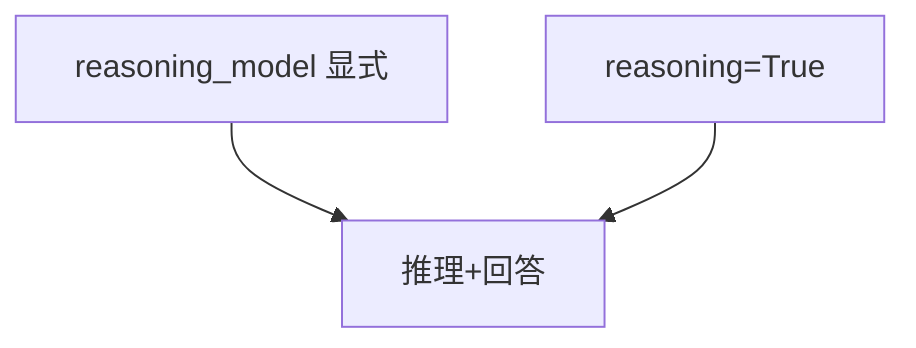

# default_chain_of_thought.py — 实现原理分析

> 源文件：`cookbook/10_reasoning/agents/default_chain_of_thought.py`

## 概述

本示例对比 **`reasoning_model` 显式双模型** 与 **`reasoning=True` 内置推理**：同一 Fibonacci 脚本问题，`show_full_reasoning=True` 流式输出。

**核心配置一览：**

| 配置项 | 值 | 说明 |
|--------|------|------|
| `manual_cot_agent` | `reasoning_model=OpenAIChat(gpt-4o, max_tokens=1200)` | 显式推理模型 |
| `default_cot_agent` | `reasoning=True` + `max_tokens=1200` | 内置 COT |

## 核心组件解析

推理内容进入 `RunOutput` / 流事件；与 `capture_reasoning_content_default_COT.py` 配合可检查 `reasoning_content` 字段。

## System Prompt 组装

无自定义 `instructions`；推理路径由 `agent.py` 中 reasoning 标志切换模型调用与附加消息（见 `agno/agent/` 与模型适配器）。

## 完整 API 请求

`OpenAIChat` → Chat Completions；推理轮次可能多次调用。

## Mermaid 流程图

```mermaid
flowchart TD
    A["reasoning_model 显式"] --> R["推理+回答"]
    B["reasoning=True"] --> R
```

## 关键源码文件索引

| 文件 | 作用 |
|------|------|
| `agno/agent/agent.py` | `reasoning` / `reasoning_model` |
