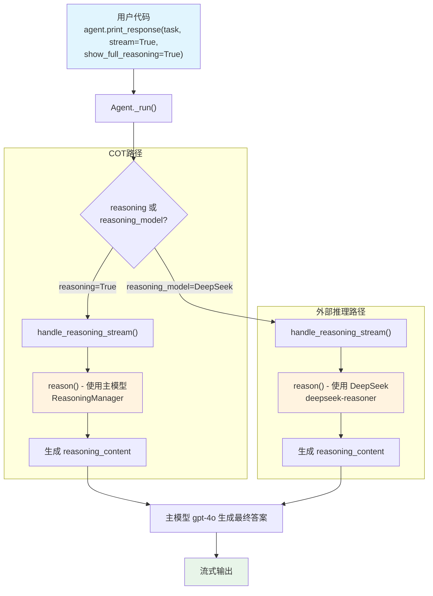

# fibonacci.py — 实现原理分析

> 源文件：`cookbook/10_reasoning/agents/fibonacci.py`

## 概述

本示例展示 Agno 的 **`reasoning`（内置链式思维）** 与 **`reasoning_model`（外部推理模型）** 两种推理机制：使用 `reasoning=True` 让主模型在内部自行推理，或指定 `reasoning_model=DeepSeek(id="deepseek-reasoner")` 将推理阶段委派给专用推理模型，最终由主模型生成回答。

**核心配置一览：**

| 配置项 | cot_agent | deepseek_agent | 说明 |
|--------|-----------|----------------|------|
| `model` | `OpenAIChat(id="gpt-4o")` | `OpenAIChat(id="gpt-4o")` | Chat Completions API |
| `reasoning` | `True` | `False`（默认） | 内置 COT 推理 |
| `reasoning_model` | `None` | `DeepSeek(id="deepseek-reasoner")` | 外部推理模型 |
| `markdown` | `True` | `True` | Markdown 格式化 |

## 架构分层

```
用户代码层                     agno.agent 层
┌──────────────────────┐    ┌──────────────────────────────────┐
│ fibonacci.py         │    │ Agent._run()                     │
│                      │    │  ├ handle_reasoning()            │
│ cot_agent:           │    │  │    reasoning=True →           │
│   reasoning=True     │───>│  │    reason(agent, ...)         │
│                      │    │  │      └ ReasoningManager.run() │
│ deepseek_agent:      │    │  │                               │
│   reasoning_model=   │───>│  │    reasoning_model 存在 →     │
│   DeepSeek(...)      │    │  │    reason(agent, ...)         │
│                      │    │  │      └ 调用 reasoning_model   │
└──────────────────────┘    └──────────────────────────────────┘
                                        │
                    ┌───────────────────┴────────────────────┐
                    ▼                                        ▼
            ┌──────────────┐                      ┌──────────────────┐
            │ OpenAIChat   │                      │ DeepSeek         │
            │ gpt-4o       │                      │ deepseek-reasoner│
            │ (主模型)     │                      │ (推理模型)       │
            └──────────────┘                      └──────────────────┘
```

## 核心组件解析

### reasoning=True（内置链式思维）

`reasoning=True` 在 `agent.py:184` 中定义，在 `_response.py:70` 的 `handle_reasoning()` 中被触发：

```python
# _response.py:73
def handle_reasoning(agent, run_response, run_messages, run_context):
    if agent.reasoning or agent.reasoning_model is not None:
        reasoning_generator = reason(
            agent=agent,
            run_response=run_response,
            run_messages=run_messages,
            run_context=run_context,
            stream_events=False,
        )
        deque(reasoning_generator, maxlen=0)  # 消费生成器
```

当 `reasoning=True` 且无 `reasoning_model` 时，`ReasoningManager` 会使用**主模型本身**完成推理阶段，将推理步骤写入 `run_response.reasoning_content`，再由主模型生成最终答案。

### reasoning_model（外部推理模型）

`reasoning_model=DeepSeek(id="deepseek-reasoner")` 在 `_init.py:216-219` 初始化时被标记为 `ModelType.REASONING_MODEL`：

```python
# _init.py:216
if agent.reasoning_model is not None:
    agent.reasoning_model = get_model(agent.reasoning_model)
    agent.reasoning_model.model_type = ModelType.REASONING_MODEL
```

此时 `reason()` 使用 `deepseek-reasoner` 模型完成完整推理链，然后将推理结果（`reasoning_content`）注入消息，最终由主模型 `gpt-4o` 生成回答。

## System Prompt 组装

| 序号 | 组成部分 | 本文件中的值/来源 | 是否生效 |
|------|---------|-----------------|---------|
| 1 | `system_message`（自定义） | None | 否 |
| 3.1 | `instructions` | None | 否 |
| 3.1.1 | 模型指令（`get_instructions_for_model`） | OpenAIChat 无额外指令 | 否 |
| 3.2.1 | `markdown` | `True` → "Use markdown to format your answers." | 是 |
| 3.2.2 | `add_datetime_to_context` | `False` | 否 |
| 3.3.15 | JSON output prompt | `use_json_mode=False` | 否 |

### 最终 System Prompt

```text
Use markdown to format your answers.
```

## 完整 API 请求

**cot_agent（reasoning=True，推理阶段先调用主模型）：**

```python
# 第一轮：推理阶段（ReasoningManager 使用主模型）
client.chat.completions.create(
    model="gpt-4o",
    messages=[
        {"role": "system", "content": "Use markdown to format your answers."},
        {"role": "user", "content": "Give me steps to write a python script for fibonacci series"},
    ],
    stream=True,
    stream_options={"include_usage": True}
)
# 第二轮：主模型基于推理结果生成最终答案
```

**deepseek_agent（reasoning_model=DeepSeek）：**

```python
# 第一轮：推理阶段（调用 deepseek-reasoner）
client.chat.completions.create(
    model="deepseek-reasoner",
    messages=[
        {"role": "system", "content": "Use markdown to format your answers."},
        {"role": "user", "content": "Give me steps to write a python script for fibonacci series"},
    ],
    stream=True,
)
# 第二轮：主模型 gpt-4o 基于推理结果生成最终答案
```

## Mermaid 流程图



## 关键源码文件索引

| 文件 | 关键函数/类 | 作用 |
|------|------------|------|
| `agno/agent/agent.py` | `reasoning` L184 | 内置 COT 开关 |
| `agno/agent/agent.py` | `reasoning_model` L185 | 外部推理模型 |
| `agno/agent/_init.py` | `get_models()` L209 | 初始化并标记推理模型类型 |
| `agno/agent/_response.py` | `handle_reasoning()` L70 | 推理触发入口 |
| `agno/agent/_response.py` | `handle_reasoning_stream()` L86 | 流式推理触发 |
