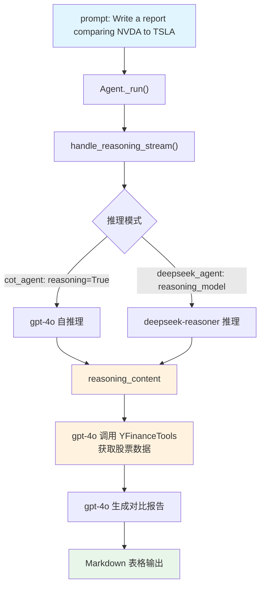

# finance_agent.py — 实现原理分析

> 源文件：`cookbook/10_reasoning/agents/finance_agent.py`

## 概述

本示例展示 Agno 的 **`reasoning`（内置链式思维）** 与 **`reasoning_model`（外部推理模型）** 在**金融分析报告**场景中的应用，同时引入了 **`YFinanceTools`** 工具和 `use_json_mode=True` 结构化输出。`cot_agent` 使用内置 COT 推理，`deepseek_agent` 使用 DeepSeek 推理模型。

**核心配置一览：**

| 配置项 | cot_agent | deepseek_agent | 说明 |
|--------|-----------|----------------|------|
| `model` | `OpenAIChat(id="gpt-4o")` | `OpenAIChat(id="gpt-4o")` | Chat Completions API |
| `tools` | `[YFinanceTools()]` | `[YFinanceTools()]` | 金融数据工具 |
| `instructions` | `"Use tables to display data"` | `["Use tables where possible"]` | 格式化指令 |
| `use_json_mode` | `True` | `False`（默认） | JSON 模式输出 |
| `reasoning` | `True` | `False`（默认） | 内置 COT 推理 |
| `reasoning_model` | `None` | `DeepSeek(id="deepseek-reasoner")` | 外部推理模型 |
| `markdown` | `True` | `True` | Markdown 格式化 |

## 架构分层

```
用户代码层                     agno.agent 层
┌──────────────────────┐    ┌──────────────────────────────────┐
│ finance_agent.py     │    │ Agent._run()                     │
│                      │    │  ├ handle_reasoning_stream()     │
│ cot_agent:           │    │  │    reason() 推理阶段           │
│   YFinanceTools()    │───>│  ├ get_tools() → YFinanceTools   │
│   use_json_mode=True │    │  └ main model response           │
│                      │    │                                  │
│ deepseek_agent:      │    │  同上但 reasoning_model=DeepSeek │
│   reasoning_model=   │───>│                                  │
│   DeepSeek(...)      │    │                                  │
└──────────────────────┘    └──────────────────────────────────┘
                                        │
                    ┌───────────────────┴────────────────────┐
                    ▼                                        ▼
            ┌──────────────┐                      ┌──────────────────┐
            │ OpenAIChat   │                      │ DeepSeek         │
            │ gpt-4o       │                      │ deepseek-reasoner│
            └──────────────┘                      └──────────────────┘
```

## 核心组件解析

### use_json_mode 与推理的交互

`use_json_mode=True` 只在 `cot_agent` 上设置，在 `_messages.py` 步骤 3.3.15 中会注入 JSON 格式化 prompt。这使得 `cot_agent` 的最终输出以 JSON 格式返回，但 markdown=True 时，JSON 输出提示不生效（`output_schema is None` 时 markdown 优先）。

实际效果：两个参数（`use_json_mode=True` + `markdown=True`）同时存在时，JSON 模式提示会被加入，但最终行为取决于模型如何响应。

### YFinanceTools 工具注册

```python
# _tools.py:105 get_tools() 中注册
tools=[YFinanceTools()]
# YFinanceTools 继承 Toolkit，注册股票价格、基本面等函数
# 工具 schema 以 JSON 格式传给模型
```

## System Prompt 组装

| 序号 | 组成部分 | 本文件中的值/来源 | 是否生效 |
|------|---------|-----------------|---------|
| 3.1 | `instructions` | `"Use tables to display data"` | 是（cot_agent） |
| 3.1 | `instructions` | `["Use tables where possible"]` | 是（deepseek_agent） |
| 3.2.1 | `markdown` | `True` | 是 |
| 3.3.5 | `_tool_instructions` | YFinanceTools 工具使用说明 | 是 |
| 3.3.15 | JSON output prompt | `use_json_mode=True`（仅 cot_agent） | 是（cot_agent） |

## Mermaid 流程图



## 关键源码文件索引

| 文件 | 关键函数/类 | 作用 |
|------|------------|------|
| `agno/agent/agent.py` | `reasoning` L184, `reasoning_model` L185 | 推理配置 |
| `agno/agent/agent.py` | `use_json_mode` L296 | JSON 模式开关 |
| `agno/agent/_response.py` | `handle_reasoning_stream()` L86 | 流式推理触发 |
| `agno/tools/yfinance.py` | `YFinanceTools` | 金融数据工具 |
