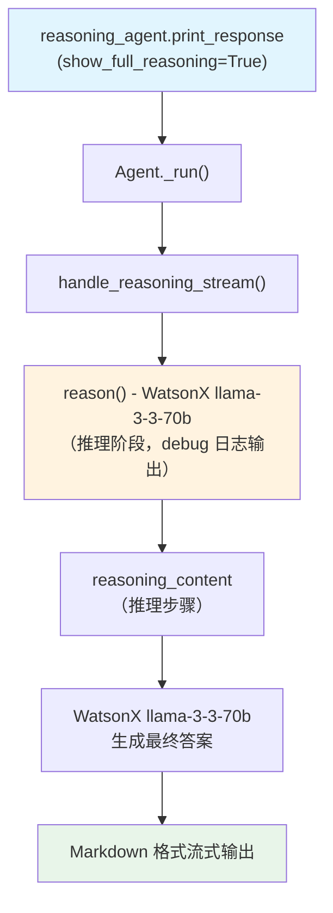

# ibm_watsonx_default_COT.py — 实现原理分析

> 源文件：`cookbook/10_reasoning/agents/ibm_watsonx_default_COT.py`

## 概述

本示例展示 Agno 的 **`reasoning=True`（内置链式思维）** 与 **IBM WatsonX 模型**（`meta-llama/llama-3-3-70b-instruct`）的结合使用。WatsonX 是 IBM 的企业级 AI 平台，通过 Agno 的统一接口即可使用其推理能力。`debug_mode=True` 会输出详细的推理调用日志。

**核心配置一览：**

| 配置项 | 值 | 说明 |
|--------|------|------|
| `model` | `WatsonX(id="meta-llama/llama-3-3-70b-instruct")` | IBM WatsonX 平台上的 Llama 3.3 |
| `reasoning` | `True` | 启用内置 COT 推理 |
| `debug_mode` | `True` | 输出详细调试日志 |
| `markdown` | `True` | Markdown 格式化 |

## 架构分层

```
用户代码层                     agno.agent 层
┌──────────────────────┐    ┌──────────────────────────────────┐
│ ibm_watsonx_         │    │ Agent._run()                     │
│ default_COT.py       │    │  ├ handle_reasoning_stream()     │
│                      │    │  │    reason() →                 │
│ reasoning_agent:     │───>│  │    ReasoningManager.run()     │
│   WatsonX(llama-3-3) │    │  │    (使用 WatsonX 推理)        │
│   reasoning=True     │    │  └ WatsonX 主模型 response       │
│   debug_mode=True    │    │                                  │
└──────────────────────┘    └──────────────────────────────────┘
                                        │
                                        ▼
                                ┌──────────────────┐
                                │ WatsonX          │
                                │ llama-3-3-70b    │
                                │ (推理 + 回答)    │
                                └──────────────────┘
```

## 核心组件解析

### WatsonX 模型与 Agno 的集成

`WatsonX` 模型类继承自 Agno 的基础 Model 类，实现了标准的 `invoke()` / `ainvoke()` 接口。当 `reasoning=True` 时，WatsonX 模型被用于推理阶段（因为没有指定单独的 `reasoning_model`），这意味着同一个 WatsonX 实例承担推理和最终回答的双重职责。

### debug_mode=True 的日志输出

`debug_mode=True` 在 `_init.py` 中通过 `set_debug()` 函数配置，会记录：
- 推理步骤的详细信息
- API 调用参数和响应
- 工具调用（如有）的详情

## System Prompt 组装

| 序号 | 组成部分 | 本文件中的值/来源 | 是否生效 |
|------|---------|-----------------|---------|
| 3.2.1 | `markdown` | `True` | 是 |
| 其他 | 未设置 | — | 否 |

### 最终 System Prompt

```text
Use markdown to format your answers.
```

## Mermaid 流程图



## 关键源码文件索引

| 文件 | 关键函数/类 | 作用 |
|------|------------|------|
| `agno/agent/agent.py` | `reasoning` L184 | 内置 COT 开关 |
| `agno/agent/agent.py` | `debug_mode` L342 | 调试模式 |
| `agno/agent/_response.py` | `handle_reasoning_stream()` L86 | 流式推理触发 |
| `agno/models/ibm` | `WatsonX` | IBM WatsonX 模型类 |
