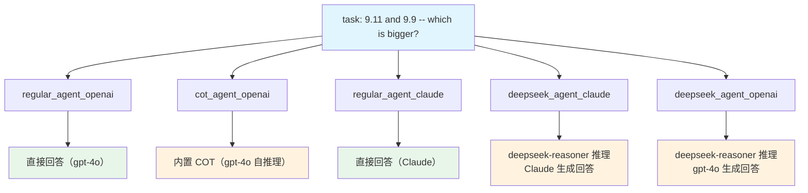

# is_9_11_bigger_than_9_9.py — 实现原理分析

> 源文件：`cookbook/10_reasoning/agents/is_9_11_bigger_than_9_9.py`

## 概述

本示例展示 Agno 的多种推理模式在**小数比较**经典测试用例上的表现对比，共使用**5 个 Agent**：普通 OpenAI、内置 COT OpenAI、普通 Claude、Claude+DeepSeek 推理、OpenAI+DeepSeek 推理。这是验证推理能力的标准测试——没有推理能力的模型常把版本号语义（9.11 > 9.9）混入数学比较。

**核心配置一览：**

| Agent | `model` | `reasoning` | `reasoning_model` | 说明 |
|-------|---------|-------------|-------------------|------|
| `regular_agent_openai` | `OpenAIChat("gpt-4o")` | `False` | `None` | 无推理 |
| `cot_agent_openai` | `OpenAIChat("gpt-4o")` | `True` | `None` | 内置 COT |
| `regular_agent_claude` | `Claude("claude-3-5-sonnet-20241022")` | `False` | `None` | 无推理 |
| `deepseek_agent_claude` | `Claude("claude-3-5-sonnet-20241022")` | `False` | `DeepSeek("deepseek-reasoner")` | 外部推理 |
| `deepseek_agent_openai` | `OpenAIChat("gpt-4o")` | `False` | `DeepSeek("deepseek-reasoner")` | 外部推理 |

## 架构分层

```
用户代码层                          agno.agent 层
┌──────────────────────────┐    ┌──────────────────────────────────┐
│ is_9_11_bigger_than_9_9  │    │ Agent._run()                     │
│ .py                      │    │  ├ handle_reasoning_stream()     │
│                          │    │  │    reason() → 推理阶段        │
│ 5 个 agent 依次运行       │───>│  └ main model response           │
│ task: "9.11 and 9.9 --   │    │                                  │
│ which is bigger?"        │    │                                  │
└──────────────────────────┘    └──────────────────────────────────┘
                                              │
          ┌───────────────────────────────────┴──────────────┐
          ▼                 ▼                                 ▼
  ┌──────────────┐  ┌──────────────┐              ┌──────────────────┐
  │ OpenAIChat   │  │ Claude       │              │ DeepSeek         │
  │ gpt-4o       │  │ claude-3-5-  │              │ deepseek-reasoner│
  │              │  │ sonnet       │              │ (推理模型)       │
  └──────────────┘  └──────────────┘              └──────────────────┘
```

## 核心组件解析

### 多模型混搭推理

`deepseek_agent_claude` 是一个有趣的组合：主模型为 Claude，推理模型为 DeepSeek。推理阶段由 `deepseek-reasoner` 完成，然后 Claude 接收推理结果生成最终答案。这展示了 Agno 的**跨模型推理**能力——推理和回答可以由不同提供商的模型承担。

### rich.console 展示

本文件使用 `rich.console.Console` 的 `rule()` 方法在终端输出分隔线，区分不同 Agent 的输出区域，增强可读性。这是纯展示层逻辑，不影响 Agent 推理流程。

## System Prompt 组装

| 序号 | 组成部分 | 本文件中的值/来源 | 是否生效 |
|------|---------|-----------------|---------|
| 3.2.1 | `markdown` | `True` | 是 |
| 其他 | 未设置 | — | 否 |

### 最终 System Prompt

```text
Use markdown to format your answers.
```

## Mermaid 流程图



## 关键源码文件索引

| 文件 | 关键函数/类 | 作用 |
|------|------------|------|
| `agno/agent/agent.py` | `reasoning` L184, `reasoning_model` L185 | 推理配置 |
| `agno/agent/_response.py` | `handle_reasoning_stream()` L86 | 流式推理触发 |
| `agno/models/anthropic` | `Claude` | Anthropic Claude 模型 |
| `agno/models/deepseek` | `DeepSeek` | DeepSeek 推理模型 |
